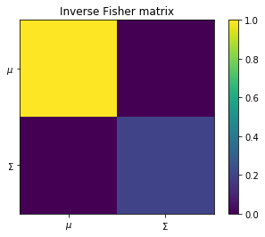
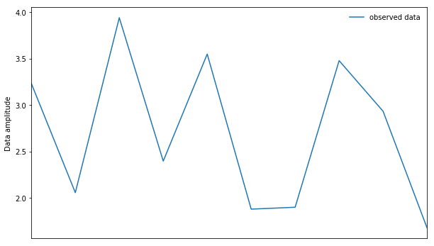
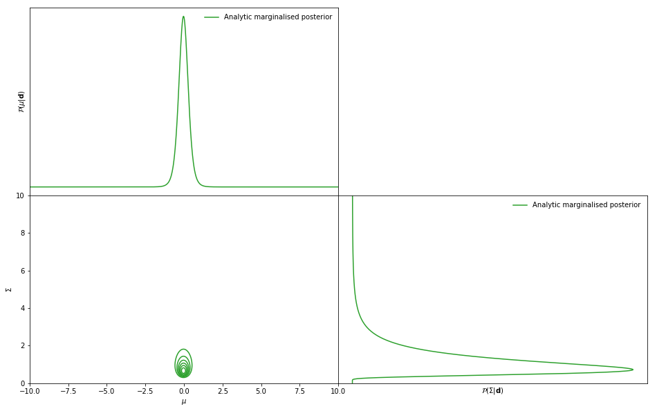
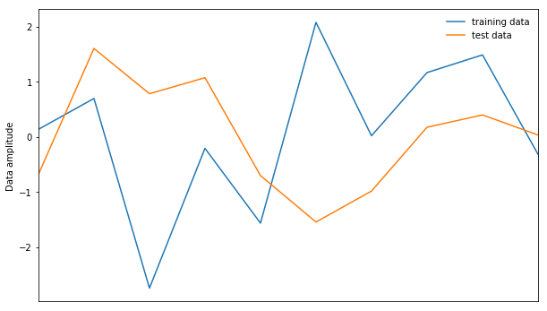
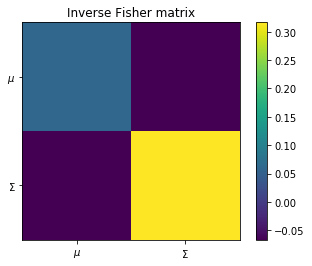
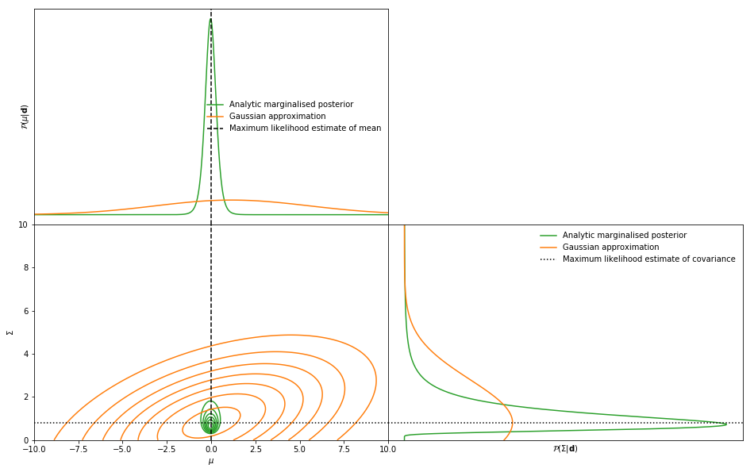
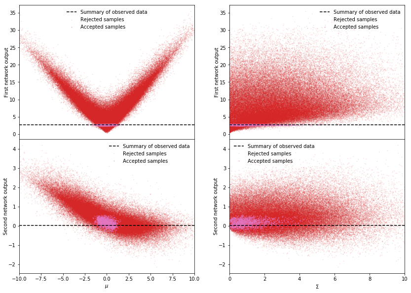
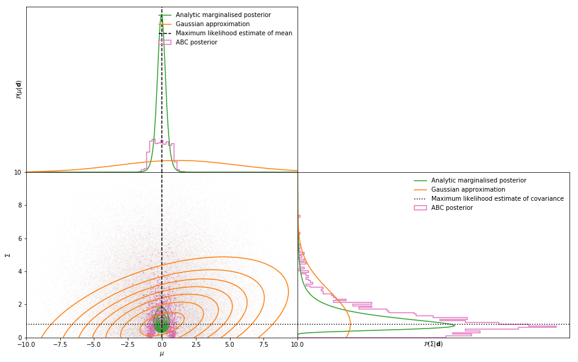
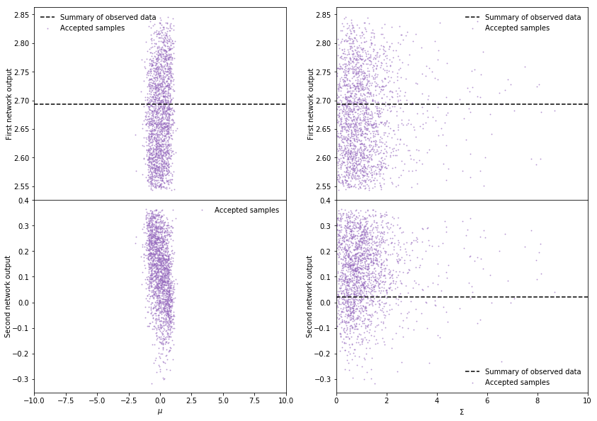
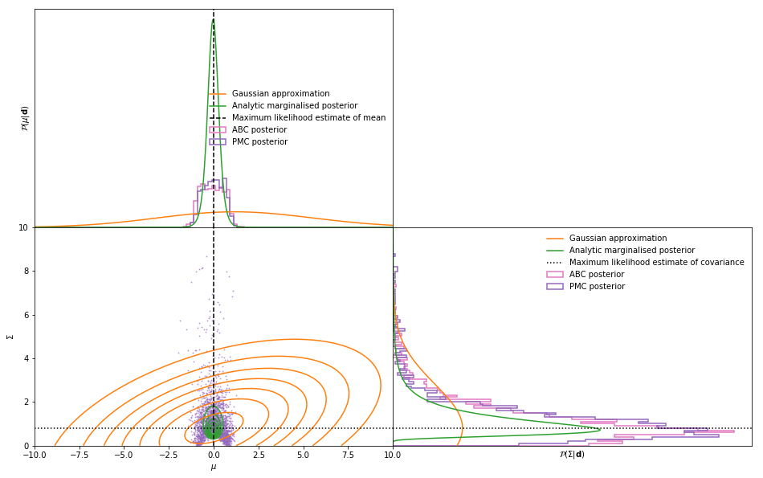

```python
%load_ext autoreload
%autoreload 2
```

# Information maximising neural network (IMNN)

Using neural networks, sufficient statistics can be obtained from data by maximising the Fisher information.

The neural network takes some data ${\bf d}$ and maps it to a compressed summary $\mathscr{f}:{\bf d}\to{\bf x}$ where ${\bf x}$ can have the same size as the dimensionality of the parameter space, rather than the data space.

To train the neural network a batch of simulations ${\bf d}_{\sf sim}^{\sf fid}$ created at a fiducial parameter value $\boldsymbol{\theta}^{\rm fid}$ are compressed by the neural network to obtain ${\bf x}_{\sf sim}^{\sf fid}$. From this we can calculate the covariance ${\bf C_\mathscr{f}}$ of the compressed summaries. We learn about model parameter distributions using the derivative of the simulation. This can be provided analytically or numercially using ${\bf d}_{\sf sim}^{\sf fid+}$ created above the fiducial parameter value $\boldsymbol{\theta}^{\sf fid+}$ and ${\bf d}_{\sf sim}^{\sf fid-}$ created below the fiducial parameter value $\boldsymbol{\theta}^{\sf fid-}$. The simulations are compressed using the network and used to find mean of the summaries $\partial\boldsymbol{\mu}_\mathscr{f}/\partial\theta_\alpha\equiv\boldsymbol{\mu}_\mathscr{f},_\alpha$ via the chain rule
$$\frac{\partial\mu}{\partial\theta_\alpha} = \frac{1}{n_{\textrm{sims}}}\sum_{i=1}^{n_{\textrm{sims}}}\frac{\partial{\bf x}_i}{\partial{\bf d}_i}\frac{\partial{\bf d}_i}{\partial\theta_\alpha}.$$
We then use ${\bf C}_\mathscr{f}$ and $\boldsymbol{\mu}_\mathscr{f},_\alpha$ to calculate the Fisher information
$${\bf F}_{\alpha\beta} = \boldsymbol{\mu}_\mathscr{f},^T_{\alpha}{\bf C}^{-1}_\mathscr{f}\boldsymbol{\mu}_\mathscr{f},_{\beta}.$$
We want to maximise the Fisher information so to train the network we minimise the loss function
$$\Lambda = -\ln|{\bf F}_{\alpha\beta}|.$$

When using this code please cite <a href="https://arxiv.org/abs/1802.03537">arXiv:1802.03537</a>.<br><br>
The code in the paper can be downloaded as v1 or v1.1 of the code kept on zenodo:<br><br>
[](https://doi.org/10.5281/zenodo.1175196)
<br>

This code is run using<br>
>`python-3.6.6`

>`tensorflow-1.12.0`

>`numpy-1.15.0`

>`tqdm==4.29.0`

Although these precise versions may not be necessary, I have put them here to avoid possible conflicts.

## Load modules


```python
%matplotlib inline
import numpy as np
import matplotlib.pyplot as plt
import tensorflow as tf
import IMNN.IMNN as IMNN
import IMNN.ABC.ABC as ABC
import IMNN.ABC.priors as priors
```

    /Users/tomcharnock/.pyenv/versions/anaconda3-5.2.0/lib/python3.6/site-packages/h5py/__init__.py:36: FutureWarning: Conversion of the second argument of issubdtype from `float` to `np.floating` is deprecated. In future, it will be treated as `np.float64 == np.dtype(float).type`.
      from ._conv import register_converters as _register_converters


# Summarising the variance

For this example we are going to use $n_{\bf d}=10$ data points of a 1D field of Gaussian noise with unknown mean and variance to see if the network can learn to summarise them.<br><br>

The likelihood is given by
$$\mathcal{L} = \prod_i^{n_{\bf d}}\frac{1}{\sqrt{2\pi|\Sigma|}}\exp\left[-\frac{1}{2}\frac{(d_i-\mu)^2}{\Sigma}\right]$$

We can solve this problem analytically, so it is useful to check how well the network does. There is a single sufficient statistic which describes each the mean and the variance, which can be found by finding the maximum of the probability. We find that
$$\sum_i^{n_{\bf d}}d_i = \mu\textrm{ and }\sum_i^{n_{\bf d}}(d_i-\mu)^2=n_{\bf d}\Sigma$$

We can calculate the Fisher information by taking the negative of second derivative of the likelihood taking the expectation by inserting the above relations at examining at some fiducial parameter values
$${\bf F}_{\alpha\beta} = -\left.\left(\begin{array}{cc}\displaystyle-\frac{1}{\Sigma}&0\\0&\displaystyle-\frac{n_{\bf d}}{2\Sigma^2}\end{array}\right)\right|_{\textrm{fiducial}}.$$
If we choose a fiducial mean of $\mu^{\textrm{fid}}=0$ and variance of $\Sigma^{\textrm{fid}} = 1$ then we obtain a Fisher information matrix of


```python
exact_fisher = -np.array([[-1/1., 0.], [0. , - 0.5 * 10 / 1.**2.]])
determinant_exact_fisher = np.linalg.det(exact_fisher)
print("determinant of the Fisher information", determinant_exact_fisher)
plt.imshow(np.linalg.inv(exact_fisher))
plt.title("Inverse Fisher matrix")
plt.xticks([0, 1], [r"$\mu$", r"$\Sigma$"])
plt.yticks([0, 1], [r"$\mu$", r"$\Sigma$"])
plt.colorbar();
```

    determinant of the Fisher information 4.999999999999999





Let us observe our _real_ data


```python
real_data = np.random.normal(0., np.sqrt(1.), size = (1, 10))
```


```python
fig, ax = plt.subplots(1, 1, figsize = (10, 6))
ax.plot(real_data[0], label = "observed data")
ax.legend(frameon = False)
ax.set_xlim([0, 9])
ax.set_xticks([])
ax.set_ylabel("Data amplitude");
```





The posterior distribution for this data (normalised to integrate to 1) is


```python
μ_array = np.linspace(-10, 10, 1000)
Σ_array = np.linspace(0.001, 10, 1000)

parameter_grid = np.array(np.meshgrid(μ_array, Σ_array))
dx = (μ_array[1] - μ_array[0]) * (Σ_array[1] - Σ_array[0])

analytic_posterior = np.exp(-0.5 * (np.sum((real_data[0][:, np.newaxis] - parameter_grid[0, 0, :][np.newaxis, :])**2., axis = 0)[:, np.newaxis] / parameter_grid[1, :, 0][np.newaxis, :] + real_data.shape[1] * np.log(2. * np.pi * parameter_grid[1, :, 0][np.newaxis, :])))
analytic_posterior = analytic_posterior / np.sum(analytic_posterior * dx)
```


```python
fig, ax = plt.subplots(2, 2, figsize = (16, 10))
plt.subplots_adjust(wspace = 0, hspace = 0)
ax[0, 0].plot(parameter_grid[0, 0, :], np.sum(analytic_posterior, axis = 1), linewidth = 1.5, color = 'C2', label = "Analytic marginalised posterior")
ax[0, 0].legend(frameon = False)
ax[0, 0].set_xlim([-10, 10])
ax[0, 0].set_ylabel('$\\mathcal{P}(\\mu|{\\bf d})$')
ax[0, 0].set_yticks([])
ax[0, 0].set_xticks([])
ax[1, 0].set_xlabel('$\mu$');
ax[1, 0].set_ylim([0, 10])
ax[1, 0].set_ylabel('$\Sigma$')
ax[1, 0].set_xlim([-10, 10])
ax[1, 0].contour(parameter_grid[0, 0, :], parameter_grid[1, :, 0], analytic_posterior.T, colors = "C2")
ax[1, 1].plot(np.sum(analytic_posterior, axis = 0), parameter_grid[1, :, 0], linewidth = 1.5, color = 'C2', label = "Analytic marginalised posterior")
ax[1, 1].legend(frameon = False)
ax[1, 1].set_ylim([0, 10])
ax[1, 1].set_xlabel('$\\mathcal{P}(\\Sigma|{\\bf d})$')
ax[1, 1].set_xticks([])
ax[1, 1].set_yticks([])
ax[0, 1].axis("off");
```





Now lets see how the information maximising neural network can recover this posterior.

## Generate data

We start by defining a function to generate the data with the correct shape. The shape must be
```
data_shape = None + input shape
```


```python
input_shape = [10]
```

It is useful to define the generating function so that it only takes in the value of the parameter as its input since the function can then be used for ABC later.<br><br>
The data needs to be generated at a fiducial parameter value and at perturbed values just below and above the fiducial parameter for the numerical derivative.


```python
θ_fid = np.array([0, 1.])
Δθpm = np.array([0.1, 0.1])
```

The data at the perturbed values should have the shape
```
perturbed_data_shape = None + number of parameters + input shape
```

The generating function is defined so that the fiducial parameter is passed as a list so that many simulations can be made at once. This is very useful for the ABC function later.


```python
def simulator(θ, seed, simulator_args):
    if seed is not None:
        np.random.seed(seed)
    if len(θ.shape) > 1:
        μ = θ[:, 0]
        Σ = θ[:, 1]
    else:
        μ = 0.
        Σ = θ
    return np.moveaxis(np.random.normal(μ, np.sqrt(Σ), simulator_args["input shape"] + [θ.shape[0]]), -1, 0)
```

### Training data
Enough data needs to be made to approximate the covariance matrix of the output summaries. The number of simulations needed to approximate the covariance is `n_s`. If the data is particularly large then it might not be possible to pass all the data into active memory at once and so several the simulations can be split into batches.

For example if we wanted to make 2000 simulations, but estimate the covariance using 1000 simulations at a time
we would set


```python
n_s = 1000
num_sims = 2 * n_s
```

The training data can now be made


```python
t = simulator(θ = np.tile(θ_fid, [num_sims, 1]), seed = None, simulator_args = {"input shape": input_shape})
```

Ideally we would be able to take the derivative of our simulations with respect to the model parameters. We can indeed do that in this case, but since this is possibly a rare occurence I will show an example where the derivatives are calculated numerically. By suppressing the sample variance between the simulations created at some lower and upper varied parameter values, far fewer simulations are needed.


```python
n_p = 100
num_partial_sims = 2 * n_p
```

The sample variance is suppressed by choosing the same initial seed when creating the upper and lower simulations.


```python
seed = np.random.randint(1e6)
t_m = simulator(θ = np.tile(θ_fid - np.array([0.1, 0.]), [num_partial_sims, 1]), seed = seed, simulator_args = {"input shape": input_shape})
t_p = simulator(θ = np.tile(θ_fid + np.array([0.1, 0.]), [num_partial_sims, 1]), seed = seed, simulator_args = {"input shape": input_shape})
t_m = np.stack([t_m, simulator(θ = np.tile(θ_fid - np.array([0., 0.1]), [num_partial_sims, 1]), seed = seed, simulator_args = {"input shape": input_shape})], axis = 1)
t_p = np.stack([t_p, simulator(θ = np.tile(θ_fid + np.array([0., 0.1]), [num_partial_sims, 1]), seed = seed, simulator_args = {"input shape": input_shape})], axis = 1)
np.random.seed()
t_d = (t_p - t_m) / (2. * Δθpm)[np.newaxis, :, np.newaxis]
```

The fiducial simulations and simulations for the derivative must be collected in a dictionary to be stored on the GPU or passed to the training function.


```python
data = {"data": t, "data_d": t_d}
```

### Test data
We should also make some test data, but here we will use only one combination. This needs concatenating to the dictionary


```python
num_validation_sims = n_s
num_validation_partial_sims = n_p
tt = simulator(θ = np.tile(θ_fid, [num_validation_sims, 1]), seed = None, simulator_args = {"input shape": input_shape})
seed = np.random.randint(1e6)
tt_m = simulator(θ = np.tile(θ_fid - np.array([0.1, 0.]), [num_validation_partial_sims, 1]), seed = seed, simulator_args = {"input shape": input_shape})
tt_p = simulator(θ = np.tile(θ_fid + np.array([0.1, 0.]), [num_validation_partial_sims, 1]), seed = seed, simulator_args = {"input shape": input_shape})
tt_m = np.stack([tt_m, simulator(θ = np.tile(θ_fid - np.array([0., 0.1]), [num_validation_partial_sims, 1]), seed = seed, simulator_args = {"input shape": input_shape})], axis = 1)
tt_p = np.stack([tt_p, simulator(θ = np.tile(θ_fid + np.array([0., 0.1]), [num_validation_partial_sims, 1]), seed = seed, simulator_args = {"input shape": input_shape})], axis = 1)
np.random.seed()
tt_d = (tt_p - tt_m) / (2. * Δθpm)[np.newaxis, :, np.newaxis]
data["data"] = np.concatenate([data["data"], tt])
data["data_d"] = np.concatenate([data["data_d"], tt_d])
```

### Data visualisation
We can plot the data to see what it looks like.


```python
fig, ax = plt.subplots(1, 1, figsize = (10, 6))
ax.plot(data['data'][np.random.randint(num_sims)], label = "training data")
ax.plot(data['data'][np.random.randint(num_sims, num_sims + num_validation_sims)], label = "test data")
ax.legend(frameon = False)
ax.set_xlim([0, 9])
ax.set_xticks([])
ax.set_ylabel("Data amplitude");
```





It is also very useful to plot the upper and lower derivatives to check that the sample variance is actually suppressed since the network learns extremely slowly if this isn't done properly.


```python
fig, ax = plt.subplots(2, 2, figsize = (20, 10))
plt.subplots_adjust(hspace = 0)
training_index = np.random.randint(num_partial_sims)
test_index = np.random.randint(num_validation_partial_sims)

ax[0, 0].plot(t_m[training_index, 0], label = "lower training data", color = "C0", linestyle = "dashed")
ax[0, 0].plot(t_p[training_index, 0], label = "upper training data", color = "C0")
ax[0, 0].plot(tt_m[test_index, 0], label = "lower validation data", color = "C1", linestyle = "dashed")
ax[0, 0].plot(tt_p[test_index, 0], label = "upper validation data", color = "C1")
ax[0, 0].legend(frameon = False)
ax[0, 0].set_xlim([0, 9])
ax[0, 0].set_xticks([])
ax[0, 0].set_ylabel("Data amplitude with varied mean")
ax[1, 0].plot(data["data_d"][training_index, 0], label = "derivative training data", color = "C0")
ax[1, 0].plot(data["data_d"][test_index + num_partial_sims, 0], label = "derivative validation data", color = "C1")
ax[1, 0].set_xlim([0, 9])
ax[1, 0].set_xticks([])
ax[1, 0].legend(frameon = False)
ax[1, 0].set_ylabel("Amplitude of the derivative of the data\nwith respect to the mean");

ax[0, 1].plot(t_m[training_index, 1], label = "lower training data", color = "C0", linestyle = "dashed")
ax[0, 1].plot(t_p[training_index, 1], label = "upper training data", color = "C0")
ax[0, 1].plot(tt_m[test_index, 1], label = "lower validation data", color = "C1", linestyle = "dashed")
ax[0, 1].plot(tt_p[test_index, 1], label = "upper validation data", color = "C1")
ax[0, 1].legend(frameon = False)
ax[0, 1].set_xlim([0, 9])
ax[0, 1].set_xticks([])
ax[0, 1].set_ylabel("Data amplitude with varied covariance")
ax[1, 1].plot(data["data_d"][training_index, 1], label = "derivative training data", color = "C0")
ax[1, 1].plot(data["data_d"][test_index + num_partial_sims, 1], label = "derivative validation data", color = "C1")
ax[1, 1].set_xlim([0, 9])
ax[1, 1].set_xticks([])
ax[1, 1].legend(frameon = False)
ax[1, 1].set_ylabel("Amplitude of the derivative of the data\nwith respect to covariance");
```


## Initiliase the neural network
### Define network parameters
The network is initialised with a base set of parameters<br>

> `"dtype"` - `int, optional` - 32 or 64 for 32 or 64 bit floats and integers

> `"number of simulations"` - `int` - the number of simulations to use to approximate covariance

> `"number of derivative simulations"` - `int` - the number of derivatives of the simulations to calculate derivative of the mean

> `"fiducial"` - `list` - fiducial parameter values at which to train the network at

> `"number of summaries"` - `int` - number of summaries the network makes from the data

> `"input shape"` - `list` - the shape of the input data

> `"filename"` - `str, optional` - a filename to save/load the graph with


```python
parameters = {
    "dtype": 32,
    "number of simulations": n_s,
    "number of derivative simulations": n_p,
    "fiducial": θ_fid.tolist(),
    "number of summaries": 2,
    "input shape": input_shape,
    "filename": "data/model",
}
```


```python
n = IMNN.IMNN(parameters = parameters)
```

## Self-defined network

The information maximising neural network must be a provided with a neural network to optimise. In principle, this should be highly specified to pull out the informative features in the data. All weights and biases should be defined in their own variable scope. Additional tensors which control, say, the dropout or the value of a leaky relu negative gradient can be defined and passed to the training and validation phase using a dictionary.

Below is an example of a network which takes in the data and passes it through a fully connected neural network with 3 hidden layers with 512 neurons in each and outputs a single summary. The activation is leaky relu on the hidden layers and linear on the output


```python
def build_network(data, **kwargs):
    α = kwargs["activation_parameter"]
    with tf.variable_scope("layer_1"):
        weights = tf.get_variable("weights", shape = [input_shape[-1], 512], initializer = tf.variance_scaling_initializer())
        biases = tf.get_variable("biases", shape = (512), initializer = tf.constant_initializer(0.01))
        output = tf.nn.leaky_relu(tf.add(tf.matmul(data, weights, name = "multiply"), biases, name = "linear_output"), α, name = "output")
    with tf.variable_scope("layer_2"):
        weights = tf.get_variable("weights", shape = (512, 512), initializer = tf.variance_scaling_initializer())
        biases = tf.get_variable("biases", shape = (512), initializer = tf.constant_initializer(0.01))
        output = tf.nn.leaky_relu(tf.add(tf.matmul(output, weights, name = "multiply"), biases, name = "linear_output"), α, name = "output")
    with tf.variable_scope("layer_3"):
        weights = tf.get_variable("weights", shape = (512, 512), initializer = tf.variance_scaling_initializer())
        biases = tf.get_variable("biases", shape = (512), initializer = tf.constant_initializer(0.01))
        output = tf.nn.leaky_relu(tf.add(tf.matmul(output, weights, name = "multiply"), biases, name = "linear_output"), α, name = "output")
    with tf.variable_scope("layer_4"):
        weights = tf.get_variable("weights", shape = (512, n.n_summaries), initializer = tf.variance_scaling_initializer())
        biases = tf.get_variable("biases", shape = (n.n_summaries), initializer = tf.constant_initializer(0.01))
        output = tf.add(tf.matmul(output, weights, name = "multiply"), biases, name = "output")
    return output
```

Extra tensor such as dropout, the activation parameter for functions such as leaky relu, or a boolean training phase parameter for batch normalisation can be added (with necessary named placeholders). Note that in the network above we only need the activation parameter, but I will leave the extra tensors in the next few cells as an example.


```python
δ = tf.placeholder(dtype = tf.float32, shape = (), name = "dropout_value")
α = tf.placeholder(dtype = tf.float32, shape = (), name = "activation_parameter")
ϕ = tf.placeholder(dtype = tf.bool, shape = (), name = "training_phase")
```

The network needs to be passed to the IMNN module only taking in a single tensor, as such we should use a lambda function passing through the tensors that we want.


```python
network = lambda x: build_network(x, activation_parameter = α, dropout_value = δ, training_phase = ϕ)
```

And now the tensor names are stored in training and validation dictionaries with their values to be called during training and validation.


```python
training_dictionary = {"dropout_value:0": 0.8,
                       "activation_parameter:0": 0.01,
                       "training_phase:0": True}

validation_dictionary = {"dropout_value:0": 1.,
                         "activation_parameter:0": 0.01,
                         "training_phase:0": False}
```

There is a very limited network building ability which can be called to build simple networks including fully connected and 1D, 2D and 3D convolutional. All weights are initialised using He initialisation, and the biases are initialised using constant values which can be specified. A limited number of activation functions can be specified (functions that do not need extra parameters), such as `tanh`, `sigmoid`, `relu`, `elu`. The network architecture is described using a list. Each element of the list is a hidden layer. A dense layer can be made using an integer where that value indicates the number of neurons. A convolutional layer can be built by using a list where the first element is an integer where the number describes the number of filters, the second element is a list of the kernel size in the x and y directions, the third element is a list of the strides in the x and y directions and the final element is string of 'SAME' or 'VALID' which describes the padding prescription.

```python
automatic_network = {
    "bias initialisation" : 0.1,
    "activation function" : tf.nn.relu,
    "hidden layers" : [512, 512, 512]
}
```


## Setup the graph
The graph can now be setup easily by passing the network to the setup function.


```python
n.setup(network = network)
```

    saving the graph as data/model.meta


The data can be preloaded to the graph by passing the dictionary to the setup function
```python
n.setup(network = network, load_data = data)
```

## Train the network
The training can now be performed by passing the number of weight and bias updates to perform, the learning rate, how many simulations to pass through the network at once and the number of simulations, number of derivatives of the simulations for training and validation, the dictionaries for training and validation tensors if they are used in the network, the data if it hasn't been preloaded to the network and whether to run the history object.

Automatically, the training function can be rerun to continue training the network further.


```python
updates = 10
at_once = 1000
learning_rate = 1e-3

n.train(updates, at_once, learning_rate, num_sims, num_partial_sims,
        num_validation_sims, num_validation_partial_sims,
        training_dictionary = training_dictionary,
        validation_dictionary = validation_dictionary,
        get_history = True, data = data, restart = False)
```

Interestingly, we seem to get a much higher value than would seem to be possible from the calculations above - a bug in the code or a bug in the calculations?

The network can also be reinitialised before training if something goes wrong by running
```python
n.train(updates, at_once, learning_rate, num_sims, num_partial_sims, num_validation_sims, num_validation_partial_sims, training_dictionary = training_dictionary, validation_dictionary = validation_dictionary, get_history = True, data = data, restart = True)
```

If run then the history object will contain the value of the determinant of the Fisher information from the training and the validation data.


```python
fig, ax = plt.subplots(1, 1, sharex = True, figsize = (10, 6))
epochs = np.arange(1, len(n.history["det F"]) + 1)
ax.plot(epochs, n.history["det F"], label = 'Training data')
ax.plot(epochs, n.history["det test F"], label = 'Test data')
ax.legend(frameon = False)
ax.axhline(determinant_exact_fisher, color = "black", linestyle = "dashed")
ax.set_xlim([1, epochs[-1]]);
```


## Resetting the network
If you need to reset the weights and biases for any reason then you can call
```python
n.reinitialise_session()
```

## Saving the network

If you don't initialise the network with a save name you can save the network as a `TensorFlow` `meta` graph. For example saving the model in the directory `./data` called `saved_model.meta` can be done using the function
```python
n.save_network(filename = "data/saved_model", first_time = True)
```
If `save file` is passed with a correct file name when initialising the module then the initialised network will be saved by
```python
n.begin_session()
```
and then saved at the end of training.

## Loading the network

You can load the network from a `TensorFlow` `meta` graph (from `/.data/saved_model.meta`) using the same parameter dictionary as used when originally training the network and then running
```python
n = IMNN(parameters = parameters)
n.restore_network()
```
Training can be continued after restoring the model - although the Adam optimiser might need to reacquaint itself.

## Approximate Bayesian computation

We can now do ABC (or PMC-ABC) with our calculated summary. From the samples we create simulations at each parameter value and feed each simulation through the network to get summaries. The summaries are compared to the summary of the real data to find the distances which can be used to accept or reject points.

We start by defining our prior as a truncated Gaussian (uniform is also available). The uniform function is taken from a version of the delfi code by Justin Alsing.

We are going to choose the mean value of the variance to be 1 with a variance of the variance of 4 cut at 0 and 10.


```python
prior = priors.TruncatedGaussian(np.array([0., 1.]), np.array([[10., 0.], [0., 10.]]), np.array([-10., 0.]), np.array([10., 10.]))
```

The ABC module takes in the _observed_ data, the prior and the TF session. It also takes in the simulator and its arguments and the validation dictionary which needs to be passed to the graph.


```python
abc = ABC.ABC(real_data = real_data, prior = prior, sess = n.sess, get_compressor = n.get_compressor, simulator = simulator, seed = None, simulator_args = {"input shape": input_shape}, dictionary = validation_dictionary)
```

## Gaussian approximation
Before running all the simulations need for approximate Bayesian computation, we can get the Gaussian approximation of the posterior from the MLE and the inverse Fisher information.


```python
print("determinant of the Fisher information", np.linalg.det(abc.fisher))
plt.imshow(np.linalg.inv(abc.fisher))
plt.title("Inverse Fisher matrix")
plt.xticks([0, 1], [r"$\mu$", r"$\Sigma$"])
plt.yticks([0, 1], [r"$\mu$", r"$\Sigma$"])
plt.colorbar();
```

    determinant of the Fisher information 68.1118





```python
gaussian_approximation, grid = abc.gaussian_approximation(gridsize = 100)
```


```python
fig, ax = plt.subplots(2, 2, figsize = (16, 10))
plt.subplots_adjust(wspace = 0, hspace = 0)
ax[0, 0].plot(parameter_grid[0, 0, :], np.sum(analytic_posterior * (parameter_grid[0, 0, 1] - parameter_grid[0, 0, 0]), axis = 1), linewidth = 1.5, color = 'C2', label = "Analytic marginalised posterior")
ax[0, 0].plot(grid[0, 0, :], np.sum(gaussian_approximation * (grid[0, 0, 1] - grid[0, 0, 0]), axis = 1), color = "C1", label = "Gaussian approximation")
ax[0, 0].axvline(abc.MLE[0, 0], linestyle = "dashed", color = "black", label = "Maximum likelihood estimate of mean")
ax[0, 0].legend(frameon = False)
ax[0, 0].set_xlim([-10, 10])
ax[0, 0].set_ylabel('$\\mathcal{P}(\\mu|{\\bf d})$')
ax[0, 0].set_yticks([])
ax[0, 0].set_xticks([])
ax[1, 0].set_xlabel('$\mu$');
ax[1, 0].set_ylim([0, 10])
ax[1, 0].set_ylabel('$\Sigma$')
ax[1, 0].set_xlim([-10, 10])
ax[1, 0].contour(parameter_grid[0, 0, :], parameter_grid[1, :, 0], analytic_posterior.T, colors = "C2")
ax[1, 0].contour(grid[0, 0, :], grid[1, :, 0], gaussian_approximation.T, colors = "C1")
ax[1, 0].axvline(abc.MLE[0, 0], linestyle = "dashed", color = "black", label = "Maximum likelihood estimate of mean")
ax[1, 0].axhline(abc.MLE[0, 1], linestyle = "dotted", color = "black", label = "Maximum likelihood estimate of covariance")
ax[1, 1].plot(np.sum(analytic_posterior * (parameter_grid[1, 1, 0] - parameter_grid[1, 0, 0]), axis = 0), parameter_grid[1, :, 0], linewidth = 1.5, color = 'C2', label = "Analytic marginalised posterior")
ax[1, 1].plot(np.sum(gaussian_approximation * (grid[1, 1, 0] - grid[1, 0, 0]), axis = 0), grid[1, :, 0], color = "C1", label = "Gaussian approximation")
ax[1, 1].axhline(abc.MLE[0, 1], linestyle = "dotted", color = "black", label = "Maximum likelihood estimate of covariance")
ax[1, 1].legend(frameon = False)
ax[1, 1].set_ylim([0, 10])
ax[1, 1].set_xlabel('$\\mathcal{P}(\\Sigma|{\\bf d})$')
ax[1, 1].set_xticks([])
ax[1, 1].set_yticks([])
ax[0, 1].axis("off");
```





### ABC
The most simple ABC takes the number of draws and a switch to state whether to run all the simulations in parallel or sequentially. The full simulations can also be saved by passing a file name. The draws are stored in the class attribute `ABC_dict`.


```python
abc.ABC(draws = 100000, at_once = True, save_sims = None)
```

In ABC, draws are accepted if the distance between the simulation summary and the simulation of the real data are "close", i.e. smaller than some ϵ value, which is chosen somewhat arbitrarily.


```python
ϵ = 1.
accept_indices = np.argwhere(abc.ABC_dict["distances"] < ϵ)[:, 0]
reject_indices = np.argwhere(abc.ABC_dict["distances"] >= ϵ)[:, 0]
```

### Plot samples
We can plot the output samples and the histogram of the accepted samples, which should peak around `θ = 1` (where we generated the real data). The monotonic function of all the output samples shows that the network has learned how to summarise the data.


```python
fig, ax = plt.subplots(2, 2, figsize = (14, 10))
plt.subplots_adjust(hspace = 0, wspace = 0.2)
ax[0, 0].scatter(abc.ABC_dict["parameters"][reject_indices, 0], abc.ABC_dict["summaries"][reject_indices, 0], s = 1, alpha = 0.1, label = "Rejected samples", color = "C3")
ax[0, 0].scatter(abc.ABC_dict["parameters"][accept_indices, 0] , abc.ABC_dict["summaries"][accept_indices, 0], s = 1, label = "Accepted samples", color = "C6", alpha = 0.5)
ax[0, 0].axhline(abc.summary[0, 0], color = 'black', linestyle = 'dashed', label = "Summary of observed data")
ax[0, 0].legend(frameon=False)
ax[0, 0].set_ylabel('First network output', labelpad = 0)
ax[0, 0].set_xlim([-10, 10])
ax[0, 0].set_xticks([])
ax[1, 0].scatter(abc.ABC_dict["parameters"][reject_indices, 0], abc.ABC_dict["summaries"][reject_indices, 1], s = 1, alpha = 0.1, label = "Rejected samples", color = "C3")
ax[1, 0].scatter(abc.ABC_dict["parameters"][accept_indices, 0] , abc.ABC_dict["summaries"][accept_indices, 1], s = 1, label = "Accepted samples", color = "C6", alpha = 0.5)
ax[1, 0].axhline(abc.summary[0, 1], color = 'black', linestyle = 'dashed', label = "Summary of observed data")
ax[1, 0].legend(frameon=False)
ax[1, 0].set_ylabel('Second network output', labelpad = 0)
ax[1, 0].set_xlim([-10, 10])
ax[1, 0].set_xlabel("$\mu$")
ax[0, 1].scatter(abc.ABC_dict["parameters"][reject_indices, 1], abc.ABC_dict["summaries"][reject_indices, 0], s = 1, alpha = 0.1, label = "Rejected samples", color = "C3")
ax[0, 1].scatter(abc.ABC_dict["parameters"][accept_indices, 1] , abc.ABC_dict["summaries"][accept_indices, 0], s = 1, label = "Accepted samples", color = "C6", alpha = 0.5)
ax[0, 1].axhline(abc.summary[0, 0], color = 'black', linestyle = 'dashed', label = "Summary of observed data")
ax[0, 1].legend(frameon=False)
ax[0, 1].set_ylabel('First network output', labelpad = 0)
ax[0, 1].set_xlim([0, 10])
ax[0, 1].set_xticks([])
ax[1, 1].scatter(abc.ABC_dict["parameters"][reject_indices, 1], abc.ABC_dict["summaries"][reject_indices, 1], s = 1, alpha = 0.1, label = "Rejected samples", color = "C3")
ax[1, 1].scatter(abc.ABC_dict["parameters"][accept_indices, 1] , abc.ABC_dict["summaries"][accept_indices, 1], s = 1, label = "Accepted samples", color = "C6", alpha = 0.5)
ax[1, 1].axhline(abc.summary[0, 1], color = 'black', linestyle = 'dashed', label = "Summary of observed data")
ax[1, 1].legend(frameon=False)
ax[1, 1].set_ylabel('Second network output', labelpad = 0)
ax[1, 1].set_xlim([0, 10])
ax[1, 1].set_xlabel("$\Sigma$");
```





```python
fig, ax = plt.subplots(2, 2, figsize = (16, 10))
plt.subplots_adjust(wspace = 0, hspace = 0)
ax[0, 0].plot(parameter_grid[0, 0, :], np.sum(analytic_posterior * (parameter_grid[0, 0, 1] - parameter_grid[0, 0, 0]), axis = 1), linewidth = 1.5, color = 'C2', label = "Analytic marginalised posterior")
ax[0, 0].plot(grid[0, 0, :], np.sum(gaussian_approximation * (grid[0, 0, 1] - grid[0, 0, 0]), axis = 1), color = "C1", label = "Gaussian approximation")
ax[0, 0].hist(abc.ABC_dict["parameters"][accept_indices, 0], np.linspace(-10, 10, 100), histtype = u'step', density = True, linewidth = 1.5, color = "C6", label = "ABC posterior");
ax[0, 0].axvline(abc.MLE[0, 0], linestyle = "dashed", color = "black", label = "Maximum likelihood estimate of mean")
ax[0, 0].legend(frameon = False, loc = "upper right")
ax[0, 0].set_xlim([-10, 10])
ax[0, 0].set_ylabel('$\\mathcal{P}(\\mu|{\\bf d})$')
ax[0, 0].set_yticks([])
ax[0, 0].set_xticks([])
ax[1, 0].set_xlabel('$\mu$');
ax[1, 0].set_ylim([0, 10])
ax[1, 0].set_ylabel('$\Sigma$')
ax[1, 0].set_xlim([-10, 10])
ax[1, 0].scatter(abc.ABC_dict["parameters"][accept_indices, 0], abc.ABC_dict["parameters"][accept_indices, 1], color = "C6", s = 1, alpha = 0.5)
ax[1, 0].scatter(abc.ABC_dict["parameters"][reject_indices, 0], abc.ABC_dict["parameters"][reject_indices, 1], color = "C3", s = 1, alpha = 0.01)
ax[1, 0].contour(parameter_grid[0, 0, :], parameter_grid[1, :, 0], analytic_posterior.T, colors = "C2")
ax[1, 0].contour(grid[0, 0, :], grid[1, :, 0], gaussian_approximation.T, colors = "C1")
ax[1, 0].axvline(abc.MLE[0, 0], linestyle = "dashed", color = "black", label = "Maximum likelihood estimate of mean")
ax[1, 0].axhline(abc.MLE[0, 1], linestyle = "dotted", color = "black", label = "Maximum likelihood estimate of covariance")
ax[1, 1].hist(abc.ABC_dict["parameters"][accept_indices, 1], np.linspace(0, 10, 100), histtype = u'step', orientation="horizontal", density = True, linewidth = 1.5, color = "C6", label = "ABC posterior");
ax[1, 1].plot(np.sum(analytic_posterior * (parameter_grid[1, 1, 0] - parameter_grid[1, 0, 0]), axis = 0), parameter_grid[1, :, 0], linewidth = 1.5, color = 'C2', label = "Analytic marginalised posterior")
ax[1, 1].plot(np.sum(gaussian_approximation * (grid[1, 1, 0] - grid[1, 0, 0]), axis = 0), grid[1, :, 0], color = "C1", label = "Gaussian approximation")
ax[1, 1].axhline(abc.MLE[0, 1], linestyle = "dotted", color = "black", label = "Maximum likelihood estimate of covariance")
ax[1, 1].legend(frameon = False)
ax[1, 1].set_ylim([0, 10])
ax[1, 1].set_xlabel('$\\mathcal{P}(\\Sigma|{\\bf d})$')
ax[1, 1].set_xticks([])
ax[1, 1].set_yticks([])
ax[0, 1].axis("off");
```





## PMC-ABC
Population Monte Carlo ABC is a way of reducing the number of draws by first sampling from a prior, accepting the closest 75% of the samples and weighting all the rest of the samples to create a new proposal distribution. The furthest 25% of the original samples are redrawn from the new proposal distribution. The furthest 25% of the simulation summaries are continually rejected and the proposal distribution updated until the number of draws needed accept all the 25% of the samples is much greater than this number of samples. This ratio is called the criterion.

If we want 1000 samples from the approximate distribution at the end of the PMC we need to set `posterior = 1000`. The initial random draw (as in ABC above) initialises with `draws`, the larger this is the better proposal distribution will be on the first iteration.

The `PMC` can be continued by running again with a smaller criterion.


```python
abc.PMC(draws = 2000, posterior = 2000, criterion = 0.05, at_once = True, save_sims = None)
```

    iteration = 18, current criterion = 0.04541841716816169, total draws = 160958, ϵ = 0.6181360185146332.

To restart the PMC from scratch then one can run
```python
abc.PMC(draws = 1000, posterior = 1000, criterion = 0.01, at_once = True, save_sims = None, restart = True)
```


```python
fig, ax = plt.subplots(2, 2, figsize = (14, 10))
plt.subplots_adjust(hspace = 0, wspace = 0.2)
ax[0, 0].scatter(abc.PMC_dict["parameters"][:, 0] , abc.PMC_dict["summaries"][:, 0], s = 1, label = "Accepted samples", color = "C4", alpha = 0.5)
ax[0, 0].axhline(abc.summary[0, 0], color = 'black', linestyle = 'dashed', label = "Summary of observed data")
ax[0, 0].legend(frameon=False)
ax[0, 0].set_ylabel('First network output', labelpad = 0)
ax[0, 0].set_xlim([-10, 10])
ax[0, 0].set_xticks([])
ax[1, 0].scatter(abc.PMC_dict["parameters"][:, 0], abc.PMC_dict["summaries"][:, 1], s = 1, alpha = 0.5, label = "Accepted samples", color = "C4")
ax[1, 0].legend(frameon=False)
ax[1, 0].set_ylabel('Second network output', labelpad = 0)
ax[1, 0].set_xlim([-10, 10])
ax[1, 0].set_xlabel("$\mu$")
ax[0, 1].scatter(abc.PMC_dict["parameters"][:, 1], abc.PMC_dict["summaries"][:, 0], s = 1, alpha = 0.5, label = "Accepted samples", color = "C4")
ax[0, 1].axhline(abc.summary[0, 0], color = 'black', linestyle = 'dashed', label = "Summary of observed data")
ax[0, 1].legend(frameon=False)
ax[0, 1].set_ylabel('First network output', labelpad = 0)
ax[0, 1].set_xlim([0, 10])
ax[0, 1].set_xticks([])
ax[1, 1].scatter(abc.PMC_dict["parameters"][:, 1], abc.PMC_dict["summaries"][:, 1], s = 1, alpha = 0.5, label = "Accepted samples", color = "C4")
ax[1, 1].axhline(abc.summary[0, 1], color = 'black', linestyle = 'dashed', label = "Summary of observed data")
ax[1, 1].legend(frameon=False)
ax[1, 1].set_ylabel('Second network output', labelpad = 0)
ax[1, 1].set_xlim([0, 10])
ax[1, 1].set_xlabel("$\Sigma$");
```





```python
fig, ax = plt.subplots(2, 2, figsize = (16, 10))
plt.subplots_adjust(wspace = 0, hspace = 0)
ax[0, 0].plot(grid[0, 0, :], np.sum(gaussian_approximation * (grid[0, 0, 1] - grid[0, 0, 0]), axis = 1), color = "C1", label = "Gaussian approximation")
ax[0, 0].hist(abc.ABC_dict["parameters"][accept_indices, 0], np.linspace(-10, 10, 100), histtype = u'step', density = True, linewidth = 1.5, color = "C6", label = "ABC posterior");
ax[0, 0].plot(parameter_grid[0, 0, :], np.sum(analytic_posterior * (parameter_grid[0, 0, 1] - parameter_grid[0, 0, 0]), axis = 1), linewidth = 1.5, color = 'C2', label = "Analytic marginalised posterior")
ax[0, 0].hist(abc.PMC_dict["parameters"][:, 0], np.linspace(-10, 10, 100), histtype = u'step', density = True, linewidth = 1.5, color = "C4", label = "PMC posterior");
ax[0, 0].axvline(abc.MLE[0, 0], linestyle = "dashed", color = "black", label = "Maximum likelihood estimate of mean")
ax[0, 0].legend(frameon = False)
ax[0, 0].set_xlim([-10, 10])
ax[0, 0].set_ylabel('$\\mathcal{P}(\\mu|{\\bf d})$')
ax[0, 0].set_yticks([])
ax[0, 0].set_xticks([])
ax[1, 0].set_xlabel('$\mu$');
ax[1, 0].set_ylim([0, 10])
ax[1, 0].set_ylabel('$\Sigma$')
ax[1, 0].set_xlim([-10, 10])
ax[1, 0].scatter(abc.PMC_dict["parameters"][:, 0], abc.PMC_dict["parameters"][:, 1], color = "C4", s = 1, alpha = 0.5)
ax[1, 0].contour(parameter_grid[0, 0, :], parameter_grid[1, :, 0], analytic_posterior.T, colors = "C2")
ax[1, 0].contour(grid[0, 0, :], grid[1, :, 0], gaussian_approximation.T, colors = "C1")
ax[1, 0].axvline(abc.MLE[0, 0], linestyle = "dashed", color = "black", label = "Maximum likelihood estimate of mean")
ax[1, 0].axhline(abc.MLE[0, 1], linestyle = "dotted", color = "black", label = "Maximum likelihood estimate of covariance")
ax[1, 1].plot(np.sum(gaussian_approximation * (grid[1, 1, 0] - grid[1, 0, 0]), axis = 0), grid[1, :, 0], color = "C1", label = "Gaussian approximation")
ax[1, 1].hist(abc.ABC_dict["parameters"][accept_indices, 1], np.linspace(0, 10, 100), histtype = u'step', orientation="horizontal", density = True, linewidth = 1.5, color = "C6", label = "ABC posterior");
ax[1, 1].plot(np.sum(analytic_posterior * (parameter_grid[1, 1, 0] - parameter_grid[1, 0, 0]), axis = 0), parameter_grid[1, :, 0], linewidth = 1.5, color = 'C2', label = "Analytic marginalised posterior")
ax[1, 1].hist(abc.PMC_dict["parameters"][:, 1], np.linspace(0, 10, 100), histtype = u'step', orientation="horizontal", density = True, linewidth = 1.5, color = "C4", label = "PMC posterior");
ax[1, 1].axhline(abc.MLE[0, 1], linestyle = "dotted", color = "black", label = "Maximum likelihood estimate of covariance")
ax[1, 1].legend(frameon = False)
ax[1, 1].set_ylim([0, 10])
ax[1, 1].set_xlabel('$\\mathcal{P}(\\Sigma|{\\bf d})$')
ax[1, 1].set_xticks([])
ax[1, 1].set_yticks([])
ax[0, 1].axis("off");
```



