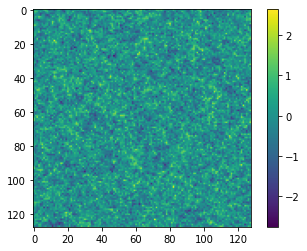
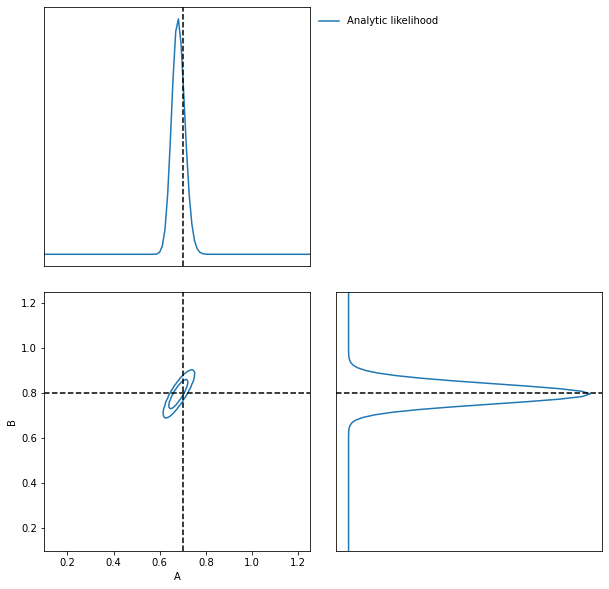
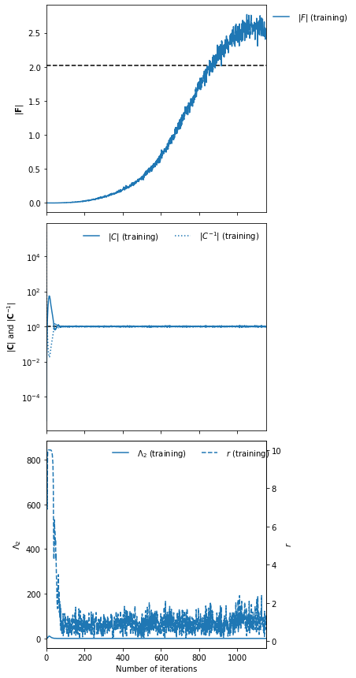
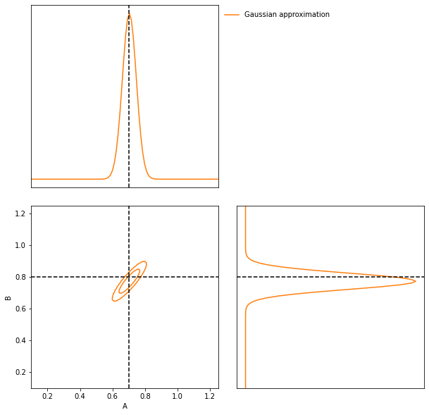
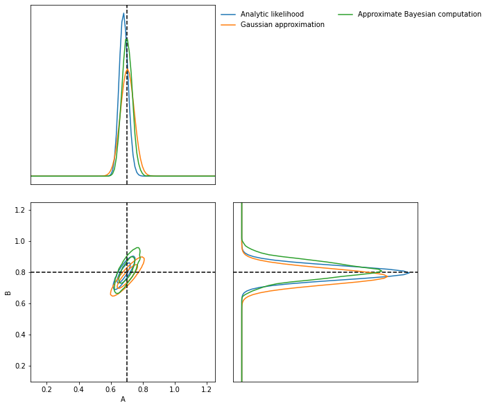
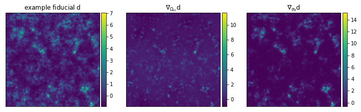
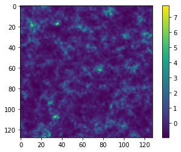
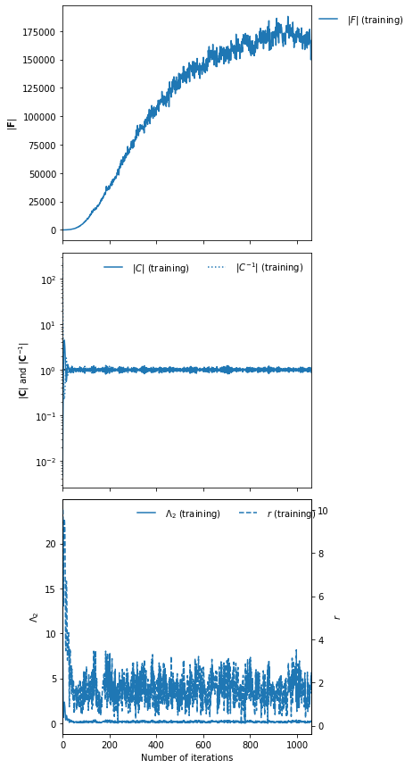
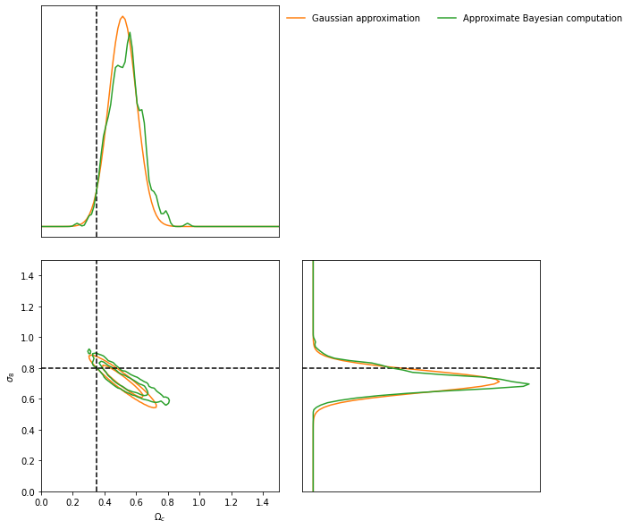

Inferring cosmology power spectrum parameters from 2D fields
============================================================

(by Lucas Makinen and Tom Charnock)

A useful example to consider is the inference of the parameter values
controlling the shape of the power spectrum used to generate 2D Gaussian
random fields. This is interesting because we can analytically calculate
the Fisher information to check our convergence and it has aspects which
are very similar to cosmological field analysis. This example is split
into two parts, first the analytic comparison when the power spectrum is
of the form

.. math:: P(k) = Ak^{-B}

and a second part where we use a jax implementation of a cosmology
library (``pip install jax-cosmo``) to infer cosmological parameters
from 2D Gaussian random fields.

In this example we will also show how inception blocks can be
implemented in a stax-like neural model.

Power law example - :math:`P(k) = Ak^{-B}`
------------------------------------------

The likelihood for an :math:`N_{\rm pix}\times N_{\rm pix}` Gaussian
field, :math:`\boldsymbol{\delta}`, can be explicitly written down for
the Fourier transformed data, :math:`\boldsymbol{\Delta}` as

.. math:: \mathcal{L}(\boldsymbol{\Delta}|\boldsymbol{\theta}) = \frac{1}{(2\pi)^{N_{\rm pix}^2 / 2} |P({\bf k}, \boldsymbol{\theta})|^{1/2}}\exp{\left(-\frac{1}{2}\boldsymbol{\Delta}\left(P({\bf k}, \boldsymbol{\theta})\right)^{-1}\boldsymbol{\Delta}\right)}

Since the Fisher information can be calculated from the expectation
value of the second derivative of the score, i.e. the log likelihood

.. math:: {\bf F}_{\alpha\beta} = - \left.\left\langle\frac{\partial^2\ln\mathcal{L}(\Delta|\boldsymbol{\theta})}{\partial\theta_\alpha\partial\theta_\beta}\right\rangle\right|_{\boldsymbol{\theta}=\boldsymbol{\theta}^\textrm{fid}}

Then we know that analytically the Fisher information must be

.. math:: {\bf F}_{\alpha\beta} = \frac{1}{2} {\rm Tr} \left(\frac{\partial P({\bf k}, \boldsymbol{\theta})}{\partial\theta_\alpha}\left(P({\bf k}, \boldsymbol{\theta})\right)^{-1}\frac{\partial P({\bf k}, \boldsymbol{\theta})}{\partial\theta_\beta}\left(P({\bf k}, \boldsymbol{\theta})\right)^{-1}\right)

where :math:`\alpha` and :math:`\beta` label the parameters :math:`A`
and :math:`B` in the power spectrum. As each :math:`k`-mode is uncoupled
for this power law form then the derivatives are

.. math::

   \begin{align}
   \frac{\partial P({\bf k}, \boldsymbol{\theta})}{\partial A} = &~k^{-B}\\
   \frac{\partial P({\bf k}, \boldsymbol{\theta})}{\partial B} = & -Ak^{-B}\ln k.\\
   \end{align}

We can set up these functions. Note that for large fields there can be
an issue with numerical overflow and as such we will use jax in 64 bit
mode.

.. code:: ipython3

    from jax.config import config
    config.update('jax_enable_x64', True)

.. code:: ipython3

    import imnn
    import imnn.lfi
    import jax
    import jax.numpy as np
    import jax_cosmo as jc
    import matplotlib.pyplot as plt
    import tensorflow_probability
    from jax.experimental import optimizers
    from jax.experimental import stax
    tfp = tensorflow_probability.substrates.jax
    rng = jax.random.PRNGKey(0)

First we’ll set up our :math:`P(k)`

.. code:: ipython3

    def P(k, A=1, B=0):
        return A * k ** (-B)

And the log likelihood is then

.. code:: ipython3

    def log_likelihood(k, A, B, Δ, N):
        Δ = Δ[1:N // 2, 1:N // 2].flatten()
        k = k[1:N // 2, 1:N // 2].flatten()
        dlength = len(k)
        def fn(_A, _B):
            nrm = np.pad(np.ones(dlength - 2) * 2, (1, 1), constant_values=1.)
            nrm = jax.ops.index_update(
              nrm, np.array([[0],[(dlength - 2)]]), np.array([[1], [1]]))
            nrm = 1
            powers = P(k, A=_A, B=_B)
            C = powers * nrm
            invC = 1. / powers
            exponent = - 0.5 * np.sum(np.conj(Δ) * invC * Δ)
            norm = -0.5 * np.sum(np.log(C)) -0.5 * len(Δ) * np.log(np.pi * 2.) 
            return (exponent + norm)
        return jax.vmap(fn)(A, B)

and the Fisher information matrix is given by

.. code:: ipython3

    def fisher(θ, k, N):
        A, B = θ
        k = k[1:N // 2, 1:N // 2].flatten()
        Pk = P(k, A, B)
        
        Cinv = np.diag(1. / Pk)
        C_A =  np.diag(k ** -B)
        C_B =  np.diag(- Pk * np.log(k))
    
        F_AA = 0.5 * np.trace((C_A @ Cinv @ C_A @ Cinv))
        F_AB = 0.5 * np.trace((C_A @ Cinv @ C_B @ Cinv))
        F_BA = 0.5 * np.trace((C_B @ Cinv @ C_A @ Cinv))
        F_BB = 0.5 * np.trace((C_B @ Cinv @ C_B @ Cinv))
    
        return np.array([[F_AA, F_AB], [F_BA, F_BB]])

Notice that we only take the unique modes to calculate the Fisher
information. To actually set up our 2D :math:`k`-modes we stack values
from :math:`0\to N_i/2 + 1` to values from :math:`-N_i/2+1\to0` and
normalising them by :math:`2\pi/N_i` where :math:`N_i` is the number of
:math:`k`-modes in each axis. If we choose that our fields have
:math:`128\times128` pixels then we can calculate :math:`k` as

.. code:: ipython3

    N = 128
    shape = (N, N)
    
    k = np.sqrt(
        np.sum(
            np.array(
                np.meshgrid(
                    *((np.hstack(
                        (np.arange(0, _shape // 2 + 1),  
                         np.arange(-_shape // 2 + 1, 0)))
                       * 2 * np.pi / _shape)**2.
                      for _shape in shape))), 
            axis=0))

For a fiducial :math:`A^\textrm{fid}=1` and :math:`B^\textrm{fid}=1/2`
we get a Fisher information matrix equal to

.. code:: ipython3

    θ_fid = np.array([1., 0.5], dtype=np.float32)
    n_params = θ_fid.shape[0]
    
    F = fisher(θ_fid, k, N)
    print(f"F = {F}")
    print(f"det(F) = {np.linalg.det(F)}")

.. parsed-literal::

    F = [[ 1984.5        -1545.06379524]
     [-1545.06379524  1690.49264978]]
    det(F) = 967560.5321330648

2D Gaussian random field simulator in jax
~~~~~~~~~~~~~~~~~~~~~~~~~~~~~~~~~~~~~~~~~

To create a 2D Gaussian random field we can follow these steps:

1. Generate a :math:`(N_\textrm{pix}\times N_\textrm{pix})` white noise
   field :math:`\varphi` such that
   :math:`\langle \varphi_k \varphi_{-k} \rangle' = 1`

2. Fourier Transform :math:`\varphi` to real space:
   :math:`R_{\rm white}({\bf x}) \rightarrow R_{\rm white}({\bf k})`
   Note that NumPy’s DFT Fourier convention is:

   .. math:: \phi_{ab}^{\bf k} = \sum_{c,d = 0}^{N-1} \exp{(-i x_c k_a - i x_d k_b) \phi^{\bf x}_{cd}}

   .. math:: \phi_{ab}^{\bf x} = \frac{1}{N^2}\sum_{c,d = 0}^{N-1} \exp{(-i x_c k_a - i x_d k_b) \phi^{\bf k}_{cd}}

3. Scale white noise :math:`R_{\rm white}({\bf k})` by the chosen power
   spectrum evaluated over a field of :math:`k` values:

   .. math:: R_P({\bf k}) = P^{1/2}(k) R_{\rm white}({\bf k}) 

   Here we need to ensure that this array of amplitudes are Hermitian,
   e.g. :math:`\phi^{* {\bf k}}_{a(N/2 + b)} = \phi^{{\bf k}}_{a(N/2 - b)}`.
   This is accomplished by choosing indices
   :math:`k_a = k_b = \frac{2\pi}{N} (0, \dots, N/2, -N/2+1, \dots, -1)`
   (as above) and then evaluating the square root of the outer product
   of the meshgrid between the two: :math:`k = \sqrt{k^2_a + k^2_b}`. We
   can then evaluate :math:`P^{1/2}(k)`.

4. Fourier Transform :math:`R_{P}({\bf k})` to real space:
   :math:`R_P({\bf x}) = \int d^d \tilde{k} e^{i{\bf k} \cdot {\bf x}} R_p({\bf k})`

   .. math:: R_{ab}^{\bf x} = \frac{1}{N^2}\sum_{c,d = 0}^{N-1} \exp{(-i x_c k_a - i x_d k_b) R^{\bf k}_{cd}}

We are going to build a broadcastable jax simultor which takes in a
variety of different shaped parameter arrays and vmaps them until a
single parameter pair are passed. This is very efficient for performing
the ABC for example. We’re also going make our simulator so that it
could have additive foregrounds (although we won’t use them in this
example) as well as a generator for log normal fields where the
:math:`P(k)` for the Fourier modes are transformed as

.. math:: P(k)\to\ln(1+P(k))

and rescaled by the volume of the simulation before generating the
field, and then the field is transformed as

.. math:: \phi\to \exp\left(\phi - \frac{\langle\phi\phi\rangle}{2}\right) - 1

.. code:: ipython3

    def simulator(rng, θ, simulator_args, foregrounds=None):
        def fn(rng, A, B):
            dim = len(simulator_args["shape"])
            L = simulator_args["L"]
            if np.isscalar(L):
                L = [L] * int(dim)
            Lk = ()
            shape = ()
            for i, _shape in enumerate(simulator_args["shape"]):
                Lk += (_shape / L[i],)
                if _shape % 2 == 0:
                    shape += (_shape + 1,)
                else:
                    shape += (_shape,)
            
            k = simulator_args["k"]
            k_shape = k.shape
            k = k.flatten()[1:]
            tpl = ()
            for _d in range(dim):
                tpl += (_d,)
    
            V = np.prod(np.array(L))
            scale = V**(1. / dim)            
            fft_norm = np.prod(np.array(Lk))
    
            rng, key = jax.random.split(rng)
                
            mag = jax.random.normal(
                key, shape=shape)
            pha = 2. * np.pi * jax.random.uniform(
                key, shape=shape)
    
            # now make hermitian field (reality condition)
            revidx = (slice(None, None, -1),) * dim
            mag = (mag + mag[revidx]) / np.sqrt(2) 
            pha = (pha - pha[revidx]) / 2 + np.pi
            dk = mag * (np.cos(pha) + 1j * np.sin(pha))
            cutidx = (slice(None, -1),) * dim
            dk = dk[cutidx]
            
            powers = np.concatenate(
                (np.zeros(1), 
                 np.sqrt(P(k, A=A, B=B)))).reshape(k_shape)
            
            if simulator_args['vol_norm']:
                powers /= V
                
            if simulator_args["log_normal"]:
                powers = np.real(
                    np.fft.ifftshift(
                        np.fft.ifftn(
                            powers) 
                        * fft_norm) * V)
        
                powers = np.log(1. + powers)
                powers = np.abs(np.fft.fftn(powers))  
            
            fourier_field = powers * dk
            fourier_field = jax.ops.index_update(
                fourier_field,
                np.zeros(dim, dtype=int),
                np.zeros((1,)))
            
            if simulator_args["log_normal"]:
                field = np.real(np.fft.ifftn(fourier_field)) * fft_norm * np.sqrt(V)
                sg = np.var(field)
                field = np.exp(field - sg / 2.) - 1.
            
            else:
                field = np.real(np.fft.ifftn(fourier_field) * fft_norm * np.sqrt(V)**2)
                
    
                
            if simulator_args["N_scale"]:
                field *= scale    
                
            if foregrounds is not None:
                rng, key = jax.random.split(key)
                foreground = foregrounds[
                    jax.random.randint(
                        key, 
                        minval=0, 
                        maxval=foregrounds.shape[0], 
                        shape=())]    
                field = np.expand_dims(field + foreground, (0,))
                
            if not simulator_args["squeeze"]:
                field = np.expand_dims(field, (0, 1))
                
            return np.array(field, dtype='float32')
    
        if isinstance(θ, tuple):
            A, B = θ
        else:
            A = np.take(θ, 0, axis=-1)
            B = np.take(θ, 1, axis=-1)
        if A.shape == B.shape:
            if len(A.shape) == 0:
                return fn(rng, A, B)
            else:
                keys = jax.random.split(rng, num=A.shape[0] + 1)
                rng = keys[0]
                keys = keys[1:]
                return jax.vmap(
                    lambda key, A, B: simulator(
                        key, (A, B), simulator_args=simulator_args))(
                    keys, A, B)
        else:
            if len(A.shape) > 0:
                keys = jax.random.split(rng, num=A.shape[0] + 1)
                rng = keys[0]
                keys = keys[1:]
                return jax.vmap(
                    lambda key, A: simulator(
                        key, (A, B), simulator_args=simulator_args))(
                    keys, A)
            elif len(B.shape) > 0:
                keys = jax.random.split(rng, num=B.shape[0])
                return jax.vmap(
                    lambda key, B: simulator(
                        key, (A, B), simulator_args=simulator_args))(
                    keys, B)

We can now set the simulator arguments, i.e. the :math:`k`-modes to
evaluate, the length of the side of a box, the shape of the box and
whether to normalise via the volume and squeeze the output dimensions

.. code:: ipython3

    simulator_args = dict(
        k=k,
        L=N,
        shape=shape,
        vol_norm=True,
        N_scale=True,
        squeeze=True,
        log_normal=False)

Now we can simulate some target data at, for example,
:math:`A^\textrm{target}=0.7` and :math:`B^\textrm{target}=0.8`:

.. code:: ipython3

    θ_target = np.array([0.7, 0.8])
    
    rng, key = jax.random.split(rng)
    δ_target = simulator(key, θ_target, simulator_args=simulator_args)
    plt.imshow(δ_target)
    plt.colorbar();

We can now define our prior distribution (in this case a uniform
distribution over :math:`A` and :math:`B`) with values between 0.1 and
1.25 for both parameters

.. code:: ipython3

    prior = tfp.distributions.Blockwise(
        [tfp.distributions.Uniform(low=low, high=high)
         for low, high in zip([0.1, 0.1], [1.25, 1.25])])
    prior.low = np.array([0.1, 0.1])
    prior.high = np.array([1.25, 1.25])

To evaluate the likelihood of this field we can now use (dividing the
target :math:`\delta` by :math:`N` to remove added scaling)

.. code:: ipython3

    LFI = imnn.lfi.LikelihoodFreeInference(
        prior=prior,
        gridsize=100)
    A, B = np.meshgrid(*LFI.ranges)
    LFI.n_targets=1
    LFI.put_marginals(
            jax.nn.softmax(
                np.real(
                    log_likelihood(
                        k, 
                        A.ravel(), 
                        B.ravel(), 
                        np.fft.fftn(δ_target / N), 
                        N)
                    ),axis=0
                ).reshape((100, 100)).T[np.newaxis]);
    LFI.marginal_plot(
        known=θ_target,          
        label="Analytic likelihood",           
        axis_labels=["A", "B"]);

Training an IMNN
----------------

Now lets train an IMNN to summaries such Gaussian random fields to see
how much information we can extract an what sort of constraints we can
get. We will use 5000 simulations to estimate the covariance and use all
of their derivatives and we’ll summarise the whole random Gaussian field
by 2 summaries.

.. code:: ipython3

    n_s = 5000
    n_d = n_s
    
    n_summaries = 2

We’re going to use a fully convolutional inception network built using
stax with some custom designed blocks. The inception block itself is
implemented as

.. code:: ipython3

    def InceptBlock(filters, strides, do_5x5=True, do_3x3=True):
        """InceptNet convolutional striding block.
        filters: tuple: (f1,f2,f3)
        filters1: for conv1x1
        filters2: for conv1x1,conv3x3
        filters3L for conv1x1,conv5x5"""
        
        filters1, filters2, filters3 = filters
        conv1x1 = stax.serial(
            stax.Conv(filters1, (1, 1), strides, padding="SAME"))
        
        filters4 = filters2
        conv3x3 = stax.serial(
            stax.Conv(filters2, (1, 1), strides=None, padding="SAME"),
            stax.Conv(filters4, (3, 3), strides, padding="SAME"))
                            
        filters5 = filters3
        conv5x5 = stax.serial(
            stax.Conv(filters3, (1, 1), strides=None, padding="SAME"),
            stax.Conv(filters5, (5, 5), strides, padding="SAME")) 
        
        maxpool = stax.serial(
            stax.MaxPool((3, 3), padding="SAME"),                   
            stax.Conv(filters4, (1, 1), strides, padding="SAME"))
                                
        if do_3x3:
            if do_5x5:
                return stax.serial(
                      stax.FanOut(4),
                      stax.parallel(conv1x1, conv3x3, conv5x5, maxpool),
                      stax.FanInConcat(), 
                      stax.LeakyRelu)
            else:
                return stax.serial(
                      stax.FanOut(3),
                      stax.parallel(conv1x1, conv3x3, maxpool),
                      stax.FanInConcat(), 
                      stax.LeakyRelu)
        else:
            return stax.serial(
                  stax.FanOut(2),
                  stax.parallel(conv1x1, maxpool),
                  stax.FanInConcat(), 
                  stax.LeakyRelu)

We’ll also want to make sure that the output of the network is the
correct shape, for which we’ll introduce a Reshaping layer

.. code:: ipython3

    def Reshape(shape):
        """Layer function for a reshape layer."""
        init_fun = lambda rng, input_shape: (shape,())
        apply_fun = lambda params, inputs, **kwargs: np.reshape(inputs, shape)
        return init_fun, apply_fun

Now we can build the network, with kernel sizes of 4 in each direction
in each layer

.. code:: ipython3

    fs = 64
    
    model = stax.serial(
            InceptBlock((fs, fs, fs), strides=(4, 4)),
            InceptBlock((fs, fs, fs), strides=(4, 4)),
            InceptBlock((fs, fs, fs), strides=(4, 4)),
            InceptBlock((fs, fs, fs), strides=(2, 2), do_5x5=False, do_3x3=False),
            stax.Conv(n_summaries, (1, 1), strides=(1, 1), padding="SAME"),
            stax.Flatten,
            Reshape((n_summaries,)))

We’ll also grab an adam optimiser from jax.experimental.optimizers

.. code:: ipython3

    optimiser = optimizers.adam(step_size=1e-3)

Note that due to the form of the network we’ll want to have simulations
that have a “channel” dimension, which we can set up by not allowing for
squeezing in the simulator.

Initialise IMNN
~~~~~~~~~~~~~~~

Finally we can initialise the IMNN, letting the IMNN module decide what
type of IMNN subclass will be used (we’ll be using SimulatorIMNN)

.. code:: ipython3

    rng, key = jax.random.split(rng)
    IMNN = imnn.IMNN(
            n_s=n_s,
            n_d=n_d,
            n_params=n_params,
            n_summaries=n_summaries,
            input_shape=(1, 1) + shape,
            θ_fid=θ_fid,
            model=model,
            optimiser=optimiser,
            key_or_state=key,
            simulator=lambda rng, θ: simulator(
                rng, θ, simulator_args={
                    **simulator_args, 
                    **{"squeeze": False}}))

.. parsed-literal::

    `simulator` provided, using SimulatorIMNN

And finally we can fit the IMNN (we’ll use generic regularisation
parameters of :math:`\lambda=10` and :math:`\epsilon=0.1`) and allow
early stopping to determine the end of fitting.

.. code:: ipython3

    %%time
    rng, key = jax.random.split(rng)
    IMNN.fit(λ=10., ϵ=0.1, rng=key, print_rate=None, min_iterations=500, best=True)

.. parsed-literal::

    CPU times: user 13min 48s, sys: 6.06 s, total: 13min 54s
    Wall time: 14min 2s

.. code:: ipython3

    IMNN.plot(expected_detF=np.linalg.det(F));

.. code:: ipython3

    np.linalg.det(IMNN.F) / np.linalg.det(F)

.. parsed-literal::

    DeviceArray(0.97123594, dtype=float64)

After nearly 1400 iterations of fitting we obtain (at the last
iteration) over 97% of the information. The maximum value of the log
determinant of the Fisher information obtained by the IMNN is slightly
over the analytic value because it is estimated over a limited set which
might accidentally have more information due to the stochastic
realisation. For this reason we choose the Fisher information at the
last iterations rather than the best fit.

Inference
---------

We can now attempt to do inference of some target data using the IMNN.
The first thing we should do is make a Gaussian approximation using a
parameter estimate from the IMNN and the Fisher information reached at
the end of fitting. Note that since the fiducial parameter values are
far from the “target” that this estimate of the Fisher information as
the covariance will likely be misleading.

.. code:: ipython3

    GA = imnn.lfi.GaussianApproximation(
        parameter_estimates=IMNN.get_estimate(np.expand_dims(δ_target, (0, 1, 2))), 
        invF=np.expand_dims(np.linalg.inv(IMNN.F), 0), 
        prior=prior, 
        gridsize=100)
    GA.marginal_plot(
        known=θ_target,          
        label="Gaussian approximation",           
        axis_labels=["A", "B"],
        colours="C1");

And finally we can do an approximate Bayesian computation

.. code:: ipython3

    ABC = imnn.lfi.ApproximateBayesianComputation(
        target_data=np.expand_dims(δ_target, (0, 1, 2)),
        prior=prior,
        simulator=lambda rng, θ: simulator(rng, θ, simulator_args={**simulator_args, **{'squeeze':False}}),
        compressor=IMNN.get_estimate,
        gridsize=100, 
        F=np.expand_dims(IMNN.F, 0))

.. code:: ipython3

    rng, key = jax.random.split(rng)
    ABC(ϵ=1., rng=key, n_samples=10000, min_accepted=1000, 
        smoothing=1, max_iterations=1000);

.. parsed-literal::

    [1010] accepted in last  43 iterations  (430000 simulations done).

.. code:: ipython3

    ax = LFI.marginal_plot(
        known=θ_target,          
        label="Analytic likelihood",           
        axis_labels=["A", "B"])
    
    
    GA.marginal_plot(
        ax=ax,
        label="Gaussian approximation",
        colours="C1", 
        axis_labels=["A", "B"])
    
    
    ABC.marginal_plot(
        ax=ax,
        label="Approximate Bayesian computation",
        colours="C2");
    
    plt.show()

Cosmological parameter inference of log normal fields
=====================================================

As a more realistic example of cosmological parameter inference from
dark matter fields, albeit it one where we do not (yet) know the amount
of information in the field, we can create a log normal field from a
power spectrum generated with cosmological parameters.

For example lets say that our fiducial cosmology has
:math:`\Omega_c=0.40` and :math:`\sigma_8=0.75`, using ``jax-cosmo`` we
can set

.. code:: ipython3

    cosmo_params = jc.Planck15(Omega_c=0.40, sigma8=0.75)
    θ_fid = np.array(
        [cosmo_params.Omega_c, 
         cosmo_params.sigma8], 
        dtype=np.float32)

Our new :math:`P(k)` is simply the linear matter power spectrum defined
as

.. code:: ipython3

    def P(k, A=0.40, B=0.75):
        cosmo_params = jc.Planck15(Omega_c=A, sigma8=B)
        return jc.power.linear_matter_power(cosmo_params, k)

.. code:: ipython3

    simulator_args = dict(
        k=k,
        L=250,
        shape=shape,
        vol_norm=True,
        N_scale=False,
        squeeze=True,
        log_normal=True)

Since our lognormal field simulator *and* power spectra code are
differentiable via ``Jax``, we can simulate a *differentiable* universe.
We’ll pull out a nice function to visualize fiducial example data and
its derivatives with respect to the cosmological parameters.

.. code:: ipython3

    from imnn.utils import value_and_jacrev, value_and_jacfwd
    
    simulation, simulation_gradient = value_and_jacfwd(
        simulator, argnums=1)(
        rng, θ_fid, simulator_args=simulator_args)

.. code:: ipython3

    from mpl_toolkits.axes_grid1 import make_axes_locatable
    fig,ax = plt.subplots(nrows=1, ncols=3, figsize=(12,15))
    
    im1 = ax[0].imshow(np.squeeze(simulation), 
                       extent=(0, 1, 0, 1))
    ax[0].title.set_text(r'example fiducial $\rm d$')
    divider = make_axes_locatable(ax[0])
    cax = divider.append_axes('right', size='5%', pad=0.05)
    fig.colorbar(im1, cax=cax, orientation='vertical')
    
    im1 = ax[1].imshow(np.squeeze(simulation_gradient).T[0].T, 
                       extent=(0, 1, 0, 1))
    ax[1].title.set_text(r'$\nabla_{\Omega_m} \rm d$')
    divider = make_axes_locatable(ax[1])
    cax = divider.append_axes('right', size='5%', pad=0.05)
    fig.colorbar(im1, cax=cax, orientation='vertical')
    
    im1 = ax[2].imshow(np.squeeze(simulation_gradient).T[1].T, 
                       extent=(0, 1, 0, 1))
    ax[2].title.set_text(r'$\nabla_{\sigma_8} \rm d$')
    divider = make_axes_locatable(ax[2])
    cax = divider.append_axes('right', size='5%', pad=0.05)
    fig.colorbar(im1, cax=cax, orientation='vertical')
    
    for a in ax:
        a.set_xticks([])
        a.set_yticks([])

We’ll now make the target universe that we observe generated with
realistic parameters - :math:`\Omega_c=0.35` and :math:`\sigma_8=0.8`

.. code:: ipython3

    θ_target = np.array([0.35, 0.8])
    
    rng, key = jax.random.split(rng)
    δ_target = simulator(
        key, θ_target, simulator_args=simulator_args, 
    )
    plt.imshow(δ_target)
    plt.colorbar();

We can now train an IMNN as before

.. code:: ipython3

    rng, key = jax.random.split(rng)
    IMNN = imnn.IMNN(
            n_s=n_s,
            n_d=n_d,
            n_params=n_params,
            n_summaries=n_summaries,
            input_shape=(1, 1) + shape,
            θ_fid=θ_fid,
            model=model,
            optimiser=optimiser,
            key_or_state=key,
            simulator=lambda rng, θ: simulator(
                rng, θ, 
                simulator_args={**simulator_args, 
                                **{"squeeze": False}}))

.. parsed-literal::

    `simulator` provided, using SimulatorIMNN

.. code:: ipython3

    %%time
    rng, key = jax.random.split(rng)
    IMNN.fit(λ=10., ϵ=0.1, rng=key, print_rate=None, min_iterations=500, best=False)

.. parsed-literal::

    CPU times: user 19min 21s, sys: 3min 38s, total: 23min
    Wall time: 23min 6s

.. code:: ipython3

    IMNN.plot(expected_detF=None);

And finally we can do our inference. We’ll first set the prior
distribution

.. code:: ipython3

    prior = tfp.distributions.Blockwise(
        [tfp.distributions.Uniform(low=low, high=high)
         for low, high in zip([0., 0.], [1.5, 1.5])])
    prior.low = np.array([0., 0.])
    prior.high = np.array([1.5, 1.5])

And make the Gaussian approximation using the Fisher information

.. code:: ipython3

    GA = imnn.lfi.GaussianApproximation(
        parameter_estimates=IMNN.get_estimate(np.expand_dims(δ_target, (0, 1, 2))), 
        invF=np.expand_dims(np.linalg.inv(IMNN.F), 0), 
        prior=prior, 
        gridsize=100)

And then run the ABC

.. code:: ipython3

    ABC = imnn.lfi.ApproximateBayesianComputation(
        target_data=np.expand_dims(δ_target, (0, 1, 2)),
        prior=prior,
        simulator=lambda rng, θ: simulator(rng, θ, simulator_args={**simulator_args, **{'squeeze':False}}),
        compressor=IMNN.get_estimate,
        gridsize=100, 
        F=np.expand_dims(IMNN.F, 0))

.. code:: ipython3

    rng, key = jax.random.split(rng)
    ABC(ϵ=0.1, rng=key, n_samples=10000, min_accepted=1000, 
        smoothing=1., max_iterations=5000);

And then we can plot the constraints obtained using the IMNN and LFI

.. code:: ipython3

    ax = GA.marginal_plot(
        known=θ_target,          
        label="Gaussian approximation",         
        axis_labels=[r"$\Omega_c$", r"$\sigma_8$"],
        colours="C1")
    ABC.marginal_plot(
        ax=ax,
        label="Approximate Bayesian computation",
        colours="C2");

