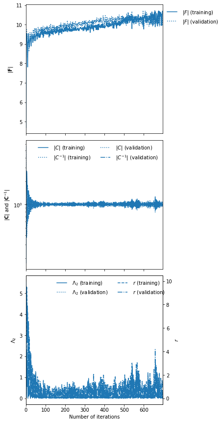
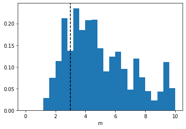

Constructing an IMNN with on-the-fly additive noise
===================================================

The IMNN is fairly flexible and extendable. As an example, lets imagine
that we have some signal that we want to do inference on, but there is
an expensive additive noise model which is can be simulated, but
simulations on the fly would be extremely expensive. In this case we
could make a set of different noises and save them to file (or in
memory, etc.) and add them randomly to the signal. If the signal model
is not differentiable then we would also have to use numerical
derivatives to obtain the derivative of the network outputs with respect
to the model parameters. This requires specific ordering of which noises
are grabbed for a single iteration.

This example will show how we can add a limited set of Gaussian noise on
the fly to sloped lines, i.e.

.. math:: y=mx+\epsilon

where our parameter of interest is a noisy slope, :math:`m = m' + \zeta`
where :math:`\zeta\leftarrow N(0, 0.1)`.

.. code:: ipython3

    from imnn import AggregatedNumericalGradientIMNN
    from imnn.lfi import ApproximateBayesianComputation
    import jax
    import jax.numpy as np
    import matplotlib.pyplot as plt
    import tensorflow_probability
    tfp = tensorflow_probability.substrates.jax
    from functools import partial
    from jax.experimental import stax
    from jax.experimental import optimizers

.. code:: ipython3

    rng = jax.random.PRNGKey(0)

We will summarise the slope using ``n_summaries=1`` summaries and
generate 2000 simulations and an extra 1000 simulations above and below
the fiducial slope value to approximate the derivatives. For the
fiducial value we’ll choose :math:`m'=1` and :math:`\delta m'=0.1`.
We’ll make :math:`x` a 100 length vector from 0 to 10. We’ll make 500
noise realisations, :math:`\epsilon`, drawn from a Gaussian with mean
zero and variance 1.

.. code:: ipython3

    n_params = 1
    n_summaries = 1
    input_shape = (100,)

    n_s = 2000
    n_d = 1000

    n_noise = 500

    m_fid = np.array([1.])
    δm = np.array([0.1])

    x = np.linspace(0, 10, input_shape[0])

The noises (which are not expensive in this case, but could be in
general) are going to be drawn from a Gaussian,
:math:`ϵ\leftarrow N(0, 1)`

.. code:: ipython3

    rng, key = jax.random.split(rng)
    ϵ = jax.random.normal(key, shape=(n_noise,) + input_shape)

We’ll also make the variable element of the simulation, :math:`\zeta`
for training and validation.

.. code:: ipython3

    rng, key, validation_key = jax.random.split(rng, num=3)
    ζ = np.sqrt(0.1) * jax.random.normal(key, shape=(n_s,))
    validation_ζ = np.sqrt(0.1) * jax.random.normal(validation_key, shape=(n_s,))

We can now make the datasets for the signal,
i.e. :math:`mx = (m^\textrm{fid} + \zeta)x` and its derivatives
:math:`mx^{\pm}=(m^\textrm{fid}\pm\delta m/2 + \zeta)x` for both the
training and the validation

.. code:: ipython3

    mx = np.expand_dims(m_fid[0] + ζ, 1) * np.expand_dims(x, 0)
    mx_mp = np.expand_dims(
        np.stack(
            [(np.expand_dims((m_fid[0] - δm[0] / 2) + ζ[:n_d], 1)
                 * np.expand_dims(x, 0)),
             (np.expand_dims((m_fid[0] + δm[0] / 2) + ζ[:n_d], 1)
                 * np.expand_dims(x, 0))],
            1),
        2)

    validation_mx = (np.expand_dims(m_fid[0] + validation_ζ, 1)
        * np.expand_dims(x, 0))
    validation_mx_mp = np.expand_dims(
        np.stack(
            [(np.expand_dims((m_fid[0] - δm[0] / 2) + validation_ζ[:n_d], 1)
                  * np.expand_dims(x, 0)),
             (np.expand_dims((m_fid[0] + δm[0] / 2) + validation_ζ[:n_d], 1)
                  * np.expand_dims(x, 0))],
            1),
        2)

Constructing a new IMNN
-----------------------

Now we can construct the new IMNN. For our example we’ll imagine that we
want to use the AggregatedNumericalGradientIMNN (normally used for large
datasets where the derivative of the simulations with respect to the
model parameters can not easily be calculated). In this case we can use
AggregatedNumericalGradientIMNN as the parent class, and initialise all
attributes and add just the noise as an input (from which we will get
the number of noises available from its shape). Now we just need to edit
two of the class functions to add random noises on the fly. First the
generators provided in ``_collect_input`` needs to be editted to output
a random key as well as the dataset. Aggregation is quite fiddly in the
IMNN due to the need to properly slice the data - the fiducial datasets
are transformed into a numpy iterator via a TensorFlow dataset, we need
to therefore augment the normal dataset to return a key as well. For
every XLA device used for aggregation then there is a separate dataset
with ``n_s // (n_devices * n_per_device)`` yields with ``n_per_device``
elements. Our generator therefore must iterate through the dataset and
return corresponding keys before resetting. To do this we will generate
``n_s`` keys and define a generator which takes in this list of keys and
the dataset and yield the next iteration of data and the ``i``\ th
iteration of keys (which resets after
``n_s // (n_devices * n_per_device)`` iterations). This is true for the
fiducial dataset, but the derivative dataset needs repeated keys for
every parameter direction used for the numerical derivative. For this
``n_d`` of the keys are repeated ``2 * n_params`` times before being
reshaped and returned by the same generator. With these generators made
we now just need to change the ``fn`` function of ``get_summary`` such
that it splits apart the signal data (called ``d``) from the key, and we
then use the key to grab a random integer between 0 and the amount of
noise passed to the class and use that integer to get noise which is
then added to the signal before the input to the neural network. Because
of the way the generators are constructed for the derivative dataset the
same noise will be added to each set of simulations for a single
derivative.

.. code:: ipython3

    class NoiseIMNN(AggregatedNumericalGradientIMNN):
        def __init__(self, noise, **kwargs):
            super().__init__(**kwargs)
            self.noise = noise
            self.n_noise = self.noise.shape[0]

        def get_summary(self, inputs, w, θ, derivative=False, gradient=False):
            def fn(inputs, w):
                d, key = inputs
                ϵ = self.noise[jax.random.randint(key, (), minval=0, maxval=self.n_noise)]
                return self.model(w, d + ϵ)
            if gradient:
                dΛ_dx, d = inputs
                dx_dw = jax.jacrev(fn, argnums=1)(d, w)
                return self._construct_gradient(dx_dw, aux=dΛ_dx, func="einsum")
            else:
                return fn(inputs, w)

        def _collect_input(self, key, validate=False):
            def generator(dataset=None, key=None, total=None):
                i = 0
                while i < total:
                    yield next(dataset), key[i]
                    i += 1
                i = 0
            if validate:
                fiducial = self.validation_fiducial
                derivative = self.validation_derivative
            else:
                fiducial = self.fiducial
                derivative = self.derivative
            keys = np.array(jax.random.split(key, num=self.n_s))
            return (
                [partial(generator, dataset=fid, key=key, total=key.shape[0])()
                 for fid, key in zip(fiducial, keys.reshape(self.fiducial_batch_shape + (2,)))],
                [partial(generator, dataset=der, key=key, total=key.shape[0])()
                 for der, key in zip(derivative, np.repeat(keys[:n_d], 2 * self.n_params, axis=0).reshape(
                     self.derivative_batch_shape + (2,)))])

We’re going to use jax’s stax module to build a simple network with
three hidden layers each with 128 neurons and which are activated by
leaky relu before outputting the two summaries. The optimiser will be a
jax Adam optimiser with a step size of 0.001.

.. code:: ipython3

    model = stax.serial(
        stax.Dense(128),
        stax.LeakyRelu,
        stax.Dense(128),
        stax.LeakyRelu,
        stax.Dense(128),
        stax.LeakyRelu,
        stax.Dense(n_summaries),
    )
    optimiser = optimizers.adam(step_size=1e-3)

The NoiseIMNN can now be initialised setting up the network and the
fitting routine (as well as the plotting function), where we will use
the CPU as the host device and use the GPUs for calculating the
summaries and say that we know that we can process 100 simulations at a
time per device before running out of memory.

.. code:: ipython3

    rng, key = jax.random.split(rng)
    imnn = NoiseIMNN(
        noise=ϵ,
        n_s=n_s,
        n_d=n_d,
        n_params=n_params,
        n_summaries=n_summaries,
        input_shape=input_shape,
        θ_fid=m_fid,
        model=model,
        optimiser=optimiser,
        key_or_state=key,
        fiducial=mx,
        derivative=mx_mp,
        δθ=δm,
        host=jax.devices("cpu")[0],
        devices=jax.devices(),
        n_per_device=100,
        validation_fiducial=validation_mx,
        validation_derivative=validation_mx_mp)

To set the scale of the regularisation we use a coupling strength 𝜆
whose value should mean that the determinant of the difference between
the covariance of network outputs and the identity matrix is larger than
the expected initial value of the determinant of the Fisher information
matrix from the network. How close to the identity matrix the covariance
should be is set by 𝜖 . These parameters should not be very important,
but they will help with convergence time. Fitting can then be done
simply by calling:

.. code:: ipython3

    rng, key = jax.random.split(rng)
    imnn.fit(λ=10., ϵ=0.1, rng=key, print_rate=1)

.. parsed-literal::

    0it [00:00, ?it/s]

.. code:: ipython3

    imnn.plot();

Inference
---------

Now lets say we want to infer the slope of some data we can use this
trained IMNN and the ABC module (with some premade simulations). I’m
going to first generate some data to infer:

.. code:: ipython3

    rng, key = jax.random.split(rng)

    target_m = 3.
    y_target = (target_m * x + np.sqrt(0.1)
                * jax.random.normal(key, shape=input_shape))

We’ll make a bunch of new simulations for the ABC too. First we’ll draw
many (5000) different values of slopes and calculate :math:`mx` for each
of these slopes. Then we’ll sum all of the expensive noise realisations
to every example to get 2500000 different realisations of noise and
signal. We’ll compress all of these using the IMNN and also repeat the
parameter values used to make these simulations (because there are now
500 examples of each parameter due to the noise realisations).

.. code:: ipython3

    rng, key = jax.random.split(rng)

    m_ABC = np.expand_dims(
        jax.random.uniform(
            key, minval=0., maxval=10., shape=(5000,)),
        1)
    y_ABC = np.einsum(
        "ij,kj->ikj",
        m_ABC * x,
        ϵ).reshape((-1,) + input_shape)

    parameters = np.repeat(m_ABC, n_noise, axis=0)
    summaries = imnn.get_estimate(y_ABC)

We’ll use TensorFlow Probability to define a prior distribution between
zero and 10 for the slope

.. code:: ipython3

    prior = tfp.distributions.Independent(
        tfp.distributions.Uniform(low=[0.], high=[10.]),
        reinterpreted_batch_ndims=1)
    prior.low = np.array([0.])
    prior.high = np.array([10.])

We’ll then initialise the ApproximateBayesianComputation module using
the IMNN as the compression function for ``y_target``

.. code:: ipython3

    ABC = ApproximateBayesianComputation(
        target_data=y_target,
        prior=prior,
        simulator=None,
        compressor=imnn.get_estimate,
        gridsize=100,
        F=imnn.F)

We can then run the ABC with an :math:`\epsilon=0.1` with the compressed
examples with corresponding parameter values

.. code:: ipython3

    ABC(ϵ=0.1, parameters=parameters, summaries=summaries);

Plotting the accepted parameters gives us the posterior distribution of
the value of possible slopes. We can also plot the value of the slope
used to generate the target data for completeness.

.. code:: ipython3

    plt.hist(ABC.parameters.accepted[0][:, 0],
             range=[0, 10],
             bins=25,
             density=True)
    plt.axvline(target_m, linestyle="dashed", color="black")
    plt.xlabel(r"$m$");

