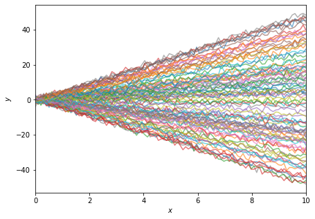
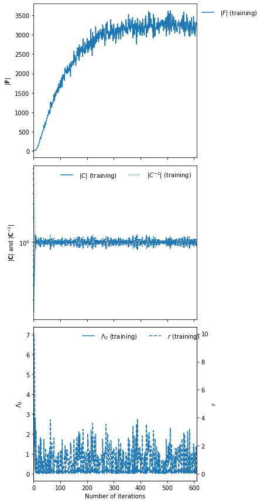
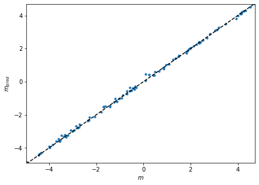
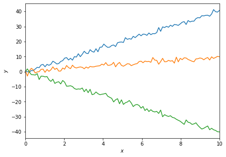
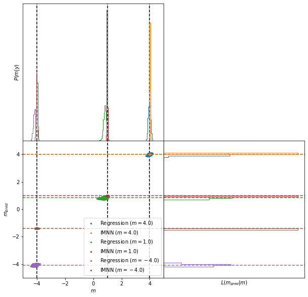

IMNN vs regression networks
===========================

In this example we’ll compare using an IMNN and training a neural
network to do regression. Specifically we’ll get an IMNN to summarise
the slopes of noisy lines, and regress a network using mean squared
error to the values of these slopes. The model is

.. math:: y=mx+\epsilon

where :math:`\epsilon\leftarrow N(0, 1)` and :math:`x\in[0,10]`. We’re
not particularly aiming to show that the IMNN is better, although in
principle, the direct targeting of the effects of the slope rather than
just seeing many realisations of slopes should allow the IMNN to extract
more information, at least at the fiducial parameter values.

.. code:: ipython3

    import jax
    import jax.numpy as np
    import imnn
    import imnn.lfi
    import tensorflow_probability
    import matplotlib.pyplot as plt
    import tqdm.auto as tqdm
    from functools import partial
    from jax.experimental import stax, optimizers
    tfp = tensorflow_probability.substrates.jax
    rng = jax.random.PRNGKey(0)

We’ll first make our simulator

.. code:: ipython3

    input_shape = (100,)
    n_params = 1
    n_summaries = n_params
    
    x = np.linspace(0, 10, input_shape[0]).astype(np.float32)
    
    def simulator(key, m, squeeze=True):
        y = (m * x[np.newaxis, :] 
             + jax.random.normal(key, shape=(m.shape[0],) + x.shape))
        if squeeze:
            y = np.squeeze(y)
        return y

And we’ll set up the prior distribution for the possible values of
:math:`m` (just a uniform between :math:`-5<m<5`)

.. code:: ipython3

    prior = tfp.distributions.Independent(
        tfp.distributions.Uniform(low=[-5.], high=[5.]),
        reinterpreted_batch_ndims=1)
    prior.low = np.array([-5.])
    prior.high = np.array([5.])

For example, some realisations of this data looks like

.. code:: ipython3

    fig = plt.figure(figsize=(7, 5))
    plt.xlabel("$x$")
    plt.xlim([0, 10])
    plt.ylabel("$y$");
    plt.tick_params(axis="both")
    rng, simulator_key, parameter_key = jax.random.split(rng, num=3)
    simulator_keys = np.array(jax.random.split(simulator_key, num=100))
    parameter_keys = np.array(jax.random.split(parameter_key, num=100))
    plt.plot(
        x, 
        jax.vmap(simulator)(
            simulator_keys, 
            jax.vmap(
                lambda key:prior.sample(seed=key))(
                parameter_keys)).T, 
        alpha=0.6);

We’re going to use a model built with stax, and use exactly the same
model (with the same initialisation) for both the IMNN and the mse
regression network

.. code:: ipython3

    model = stax.serial(
        stax.Dense(128),
        stax.LeakyRelu,
        stax.Dense(128),
        stax.LeakyRelu,
        stax.Dense(128),
        stax.LeakyRelu,
        stax.Dense(n_summaries),
    )
    optimiser = optimizers.adam(step_size=1e-3)

The IMNN does the initialisation by just providing a key on the class
instantiation, and we’ll manually initialise the mse network in the same
way. To make a better comparison we’re going to ensure that the same
number of simulations are seen by both networks. Note that for the IMNN,
these will all be simulations at the same parameter value (with their
gradients calculated automatically) whilst with the regression network,
the simulations will be made with slopes drawn randomly from the prior.
To do this we’re going to set the number of simulations for the IMNN to
be ``n_s=1000`` and for no real reason, we’ll choose the fiducial
parameter value to be :math:`m^\textrm{fid}=4`.

.. code:: ipython3

    n_s = 1000
    n_d = n_s
    m_fid = np.array([4.])

Now to initialise the networks we’ll get a random number generator

.. code:: ipython3

    rng, key = jax.random.split(rng)

And pass the simulator to the IMNN decision function

.. code:: ipython3

    IMNN = imnn.IMNN(
        n_s=n_s, n_d=n_d, n_params=n_params, n_summaries=n_summaries,
        input_shape=input_shape, θ_fid=m_fid, model=model, 
        optimiser=optimiser, key_or_state=key,
        simulator=lambda key, m: simulator(key, m))

.. parsed-literal::

    `simulator` provided, using SimulatorIMNN

We’ll then initialise the model for the regression network with the same
key.

.. code:: ipython3

    mse_output, mse_w = model[0](key, input_shape)
    mse_state = optimiser[0](mse_w)

To see that they are the same we can pass the same piece of data through
the networks and look at the value of the result

.. code:: ipython3

    rng, key = jax.random.split(rng)
    print("IMNN output = " +
          f"{IMNN.model(IMNN.w, simulator(key, np.array([1.])))}")
    print("regression network output = " +
          f"{model[1](mse_w, simulator(key, np.array([1.])))}")

.. parsed-literal::

    IMNN output = [-1.4816203]
    regression network output = [-1.4816203]

We’ll train the IMNN first so we know how many epochs to run the
training of the regression network for, since the IMNN will stop
according to early stopping on the amount of information extracted

.. code:: ipython3

    rng, key = jax.random.split(rng)
    IMNN.fit(λ=10., ϵ=0.1, rng=key, print_rate=1, best=False)
    IMNN.plot();

.. parsed-literal::

    0it [00:00, ?it/s]

It took 611 iterations of training until early stopping finished the
fitting of the IMNN, so we will run the regression for the same amount
of time, training it with 611000 different simulations. We’ll actually
run the simulations on the fly, and we’ll make fixed validation set to
compare.

.. code:: ipython3

    rng, key = jax.random.split(rng)
    validation_m = prior.sample(100, seed=key)
    
    rng, *keys = jax.random.split(rng, num=101)
    validation_y = jax.vmap(simulator)(
        np.array(keys), validation_m)

The loss function to optimise will take a random number and the current
network parameters, and generate ``n_s`` :math:`m` values and generate
simulations at each of these values and then calculate the mean squared
difference between the output of the network with the simulation as an
input and the value of :math:`m` just drawn. We’ll also get the value
and the gradient of this function.

.. code:: ipython3

    @jax.jit
    def mse(w, m, y):
        return np.mean((model[1](w, y) - m)**2.)
    
    @partial(jax.value_and_grad, argnums=1)
    @jax.jit
    def g_mse(rng, w):
        m_key, y_key = jax.random.split(rng)
        m = prior.sample(n_s, seed=m_key)
        y_keys = np.array(jax.random.split(y_key, num=n_s))
        y = jax.vmap(simulator)(y_keys, m)
        return mse(w, m, y)

Now we’ll run the training

.. code:: ipython3

    mse_loss = np.zeros((611, 2))
    bar = tqdm.trange(611)
    for i in bar:
        w = optimiser[2](mse_state)
        rng, key = jax.random.split(rng)
        l, g = g_mse(key, w)
        mse_state = optimiser[1](i, g, mse_state)
        w = optimiser[2](mse_state)
        mse_loss = jax.ops.index_update(
            mse_loss, 
            jax.ops.index[i], 
            [l, mse(w, validation_m, validation_y)])
        bar.set_postfix(loss=mse_loss[i])

.. parsed-literal::

      0%|          | 0/611 [00:00<?, ?it/s]

.. code:: ipython3

    fig = plt.figure(figsize=(7, 5))
    plt.semilogy(mse_loss)
    plt.xlabel("Number of epochs")
    plt.ylabel("Mean squared error")
    plt.xlim([0, 611])
    plt.legend(["Training", "Validation"]);

.. image:: output_28_0.png

We can also check how well the regression network works with a test set

.. code:: ipython3

    rng, key = jax.random.split(rng)
    test_m = prior.sample(100, seed=key)
    
    rng, *keys = jax.random.split(rng, num=101)
    test_y = jax.vmap(simulator)(
        np.array(keys), test_m)
    
    mse_m = model[1](w, test_y)

.. code:: ipython3

    fig = plt.figure(figsize=(7, 5))
    plt.scatter(test_m, mse_m, s=10)
    plt.plot(
        [test_m.min(), test_m.max()], 
        [test_m.min(), test_m.max()], 
        linestyle="dashed", 
        color="black")
    plt.xlim([test_m.min(), test_m.max()])
    plt.ylim([mse_m.min(), mse_m.max()])
    plt.xlabel("$m$")
    plt.ylabel("$m_{pred}$");

Inference
~~~~~~~~~

Now we can use both of these networks to do some inference. We’re going
to try and infer the value of the slopes for three lines, one generated
at a value at the fiducial, one not far from the fiducial and one very
far, i.e. :math:`m^\textrm{target}=\{4, 1, -4\}`.

.. code:: ipython3

    rng, *keys = jax.random.split(rng, num=4)
    target_m = np.expand_dims(np.array([4., 1., -4.]), 1)
    target_data = jax.vmap(simulator)(np.array(keys), target_m)

.. code:: ipython3

    fig = plt.figure(figsize=(7, 5))
    plt.xlabel("$x$")
    plt.xlim([0, 10])
    plt.ylabel("$y$");
    plt.tick_params(axis="both")
    plt.plot(x, target_data.T);

If we just look at the estimated target values we can see that both
networks do well close to the fiducial parameter values, but the IMNN
does badly far from the fiducial

.. code:: ipython3

    print(f"IMNN parameter estimates = {IMNN.get_estimate(target_data)}")
    print(f"regression parameter estimates = {model[1](w, target_data)}")

.. parsed-literal::

    IMNN parameter estimates = [[ 4.0084834 ]
     [ 0.98241055]
     [-1.40224   ]]
    regression parameter estimates = [[ 3.9941278 ]
     [ 0.83408386]
     [-4.071932  ]]

However, if we do the LFI, i.e. just run an ABC to get 1000 samples
within an epsilon ball of :math:`\epsilon=0.1` we can compare the
approximate posteriors. Note this epsilon doesn’t mean the same thing
for the two different estimators so choosing the same value doesn’t
really indicate how “marginal” the slice through the joint distribution
of summaries and parameters is - for this reason we’ll show the whole
joint space.

.. code:: ipython3

    ABC = imnn.lfi.ApproximateBayesianComputation(
        target_data=target_data,
        prior=prior,
        simulator=partial(simulator, squeeze=False),
        compressor=IMNN.get_estimate,
        F=np.stack([IMNN.F for i in range(3)], axis=0))
    mse_ABC = imnn.lfi.ApproximateBayesianComputation(
        target_data=target_data,
        prior=prior,
        simulator=partial(simulator, squeeze=False),
        compressor=lambda y: model[1](w, y))

.. code:: ipython3

    rng, key = jax.random.split(rng)
    ABC(rng=key, ϵ=0.1, n_samples=100000, min_accepted=1000, max_iterations=1000);
    mse_ABC(rng=key, ϵ=0.1, n_samples=100000, min_accepted=1000, max_iterations=1000);

.. parsed-literal::

    [1004 1043 2819] accepted in last  28 iterations  (2800000 simulations done).
    [1956 2003 2034] accepted in last  1 iterations  (100000 simulations done).

And now we’ll plot the joint space for all of the targets. The top
subplot shows the a histogram of the parameter values used to generate
simulations whose summaries are closest to the summaries of the target
data, i.e. the approximate posterior. The bottom scatter plot shows the
joint space of parameters and summary values (parameter estimates) and
the bottom right subplot shows the likelihood of the summary values,
i.e. the probability of values of the summaries at a given value of the
target parameters.

.. code:: ipython3

    fig, ax = plt.subplots(2, 2, figsize=(10, 10))
    plt.subplots_adjust(wspace=0, hspace=0)
    for i in range(3):
        ax[0, 0].axvline(
            target_m[i], 
            color="black", 
            linestyle="dashed", 
            zorder=-1)
        ax[0, 0].hist(
            mse_ABC.parameters.accepted[i].T, 
            range=[-5., 5.], 
            bins=200, 
            histtype="step", 
            density=True)
        ax[0, 0].hist(
            ABC.parameters.accepted[i].T, 
            range=[-5., 5.], 
            bins=200, 
            histtype="step", 
            density=True)
        ax[1, 0].axhline(
            mse_ABC.target_summaries[i], 
            linestyle="dashed",
            color=f"C{i * 2}",
            zorder=-1)
        ax[1, 0].axhline(
            ABC.target_summaries[i], 
            linestyle="dashed",
            color=f"C{i * 2 + 1}",
            zorder=-1)
        ax[1, 0].axvline(
            target_m[i], 
            color="black", 
            linestyle="dashed",
            zorder=-1)
        ax[1, 0].scatter(
            mse_ABC.parameters.accepted[i], 
            mse_ABC.summaries.accepted[i], 
            s=5,
            label=f"Regression ($m = {target_m[i][0]}$)")
        ax[1, 0].scatter(
            ABC.parameters.accepted[i], 
            ABC.summaries.accepted[i], 
            s=5,
            label=f"IMNN ($m = {target_m[i][0]}$)")
        ax[1, 1].axhline(
            mse_ABC.target_summaries[i], 
            linestyle="dashed",
            color=f"C{i * 2}",
            zorder=-1)
        ax[1, 1].axhline(
            ABC.target_summaries[i], 
            linestyle="dashed",
            color=f"C{i * 2 + 1}",
            zorder=-1)
        ax[1, 1].hist(
            mse_ABC.summaries.accepted[i].T, 
            range=[-5., 5.], 
            bins=100, 
            histtype="step", 
            density=True, 
            orientation="horizontal")
        ax[1, 1].hist(
            ABC.summaries.accepted[i].T, 
            range=[-5., 5.], 
            bins=100, 
            histtype="step", 
            density=True, 
            orientation="horizontal")
    
    ax[1, 0].legend(loc=4)
    ax[0, 1].axis("off")
    ax[0, 0].set(
        xticks=[],
        yticks=[],
        xlim=(-5, 5),
        ylabel="$P(m|y)$")
    ax[1, 0].set(
        xlabel="$m$",
        ylabel="$m_{pred}$",
        xlim=(-5, 5),
        ylim=(-5, 5))
    ax[1, 1].set(
        xticks=[],
        yticks=[],
        ylim=(-5, 5),
        xlabel="$L(m_{pred}|m)$");

Here we can see that the IMNN has consistently tighter posteriors (top
subplot) than the regression network, and seemingly less bias (looking
at the green constraints from the regression network and the red
constraints from the INMN). Here, clearly the size of the epsilon is
apparently accepting summaries from further away for the regression
network, but even just looking (again the green) scatter points, the
bulk of the scatter points at the horizontal green line is further from
the black dashed vertical line showing that more samples would be needed
inside a smaller epsilon ball which would likely lead to a wide
posterior anyway.

Cool hey!
