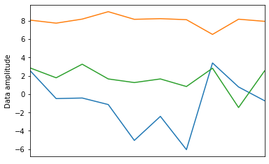
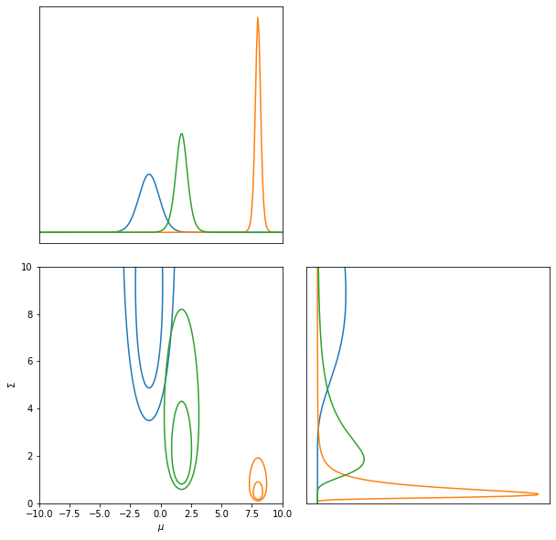
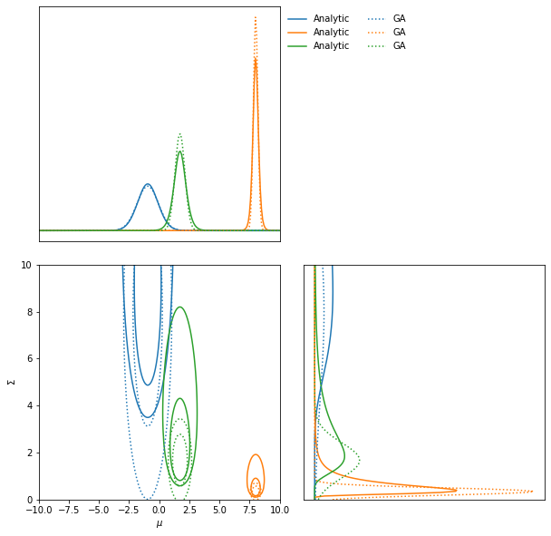
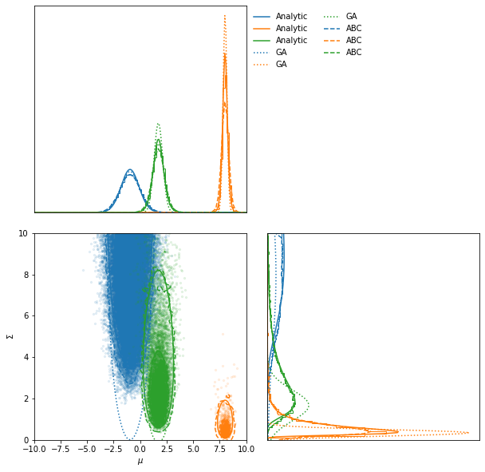
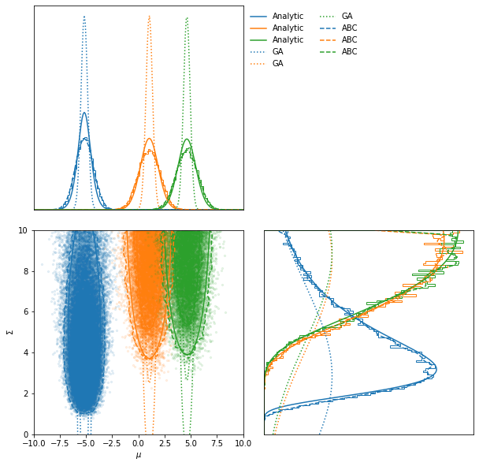
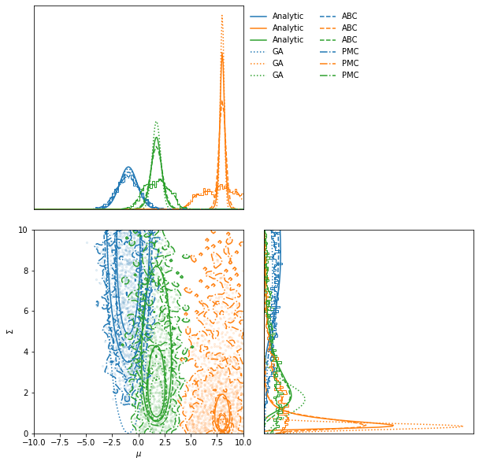
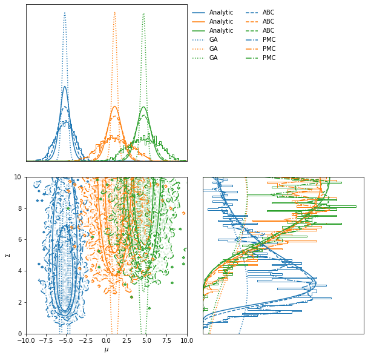

Summarising the mean and the variance
=====================================

.. code:: ipython3

    import jax
    import jax.numpy as np
    import tensorflow_probability
    import matplotlib.pyplot as plt
    from functools import partial
    import imnn.lfi
    tfp = tensorflow_probability.substrates.jax
    tfd = tfp.distributions
    rng = jax.random.PRNGKey(2)

For this example we are going use the LFI module to infer the unknown
mean, :math:`\mu`, and variance, :math:`\Sigma`, of :math:`n_{\bf d}=10`
data points of two 1D random Gaussian field,
:math:`{\bf d}=\{d_i\sim\mathcal{N}(\mu,\Sigma)|i\in[1, n_{\bf d}]\}`.
This is an interesting problem since we know the likelihood
analytically, but it is non-Gaussian

.. math:: \mathcal{L}({\bf d}|\mu,\Sigma) = \prod_i^{n_{\bf d}}\frac{1}{\sqrt{2\pi|\Sigma|}}\exp\left[-\frac{1}{2}\frac{(d_i-\mu)^2}{\Sigma}\right]

.. code:: ipython3

    def likelihood(θ):
        μ, Σ = θ[..., 0], θ[..., 1]
        return tfd.Independent(
            tfd.Normal(
                np.repeat(np.expand_dims(μ, -1), 10, axis=-1),
                np.repeat(np.expand_dims(np.sqrt(Σ), -1), 10, axis=-1),),
            reinterpreted_batch_ndims=1)

We’re going to say that we know for certain that the mean must be within
a range of :math:`-10<\mu<10` and the variance within a range of
:math:`0<\Sigma<10` but with no knowledge of how likely they are and so
use a uniform prior distribution. For the inference we start by defining
our prior as a uniform distribution. This distribution can be a
TensorFlow Probability distribution for simplicity.

.. math:: p(\mu,\Sigma)=\textrm{Uniform}\left[\textrm{lower}=(-10, 0),\textrm{upper}=(10,10)\right]

.. code:: ipython3

    low = np.array([-10., 0.])
    high = np.array([10., 10.])
    prior = tfd.Blockwise([tfd.Uniform(low=low[i], high=high[i]) for i in range(low.shape[0])])
    prior.low = np.array([distribution.low for distribution in prior.distributions])
    prior.high = np.array([distribution.high for distribution in prior.distributions])

We’ve added the attributes ``low`` and ``high`` to the distribution for
the ``lfi`` functions.

Now we can generate the target data

.. code:: ipython3

    rng, parameter_key, simulator_key = jax.random.split(rng, num=3)
    target_θ = np.array([[-1, 5], [8, 0.5], [2, 3]])#prior.sample(3, seed=parameter_key)
    target_data = likelihood(target_θ).sample(seed=simulator_key)

.. code:: ipython3

    fig, ax = plt.subplots(1, 1)
    ax.plot(target_data.T)
    ax.set(
        ylabel="Data amplitude",
        xticks=[],
        xlim=(0, 9));

As well as knowing the likelihood for this problem, we also know what
sufficient statistics describe the mean and variance of the data - they
are the mean and the variance

.. math:: \frac{1}{n_{\bf d}}\sum_i^{n_{\bf d}}d_i = \mu\textrm{  and  }\frac{1}{n_{\bf d}-1}\sum_i^{n_{\bf d}}(d_i-\mu)^2=\Sigma

This means we can make an exact compression function

.. code:: ipython3

    def compressor(simulation):
        return np.stack([
         np.mean(simulation, axis=-1),
         np.var(simulation, axis=-1)], 
        axis=-1)

.. code:: ipython3

    print(f"Mean and variance of observed data = {compressor(target_data)}")

.. parsed-literal::

    Mean and variance of observed data = [[-0.95406663  7.982314  ]
     [ 8.011085    0.34187225]
     [ 1.7216978   1.6701807 ]]

We might want to know how likely it is that any particular parameters of
the Gaussian model are given that we have observed this data. This is
given by the posterior distribution

.. math:: \mathcal{P}(\mu,\Sigma|{\bf d})\propto\mathcal{L}({\bf d}|\mu,\Sigma)p(\mu, \Sigma)

For example, let’s say we want to know how likely it is that this data
came from a model with some fiducial parameters
:math:`\mu^\textrm{fid}=0` and :math:`\Sigma^\textrm{fid}=1`.

.. code:: ipython3

    θ_fid = np.array([0., 1.])

We can evaluate the analytic posterior using:

.. code:: ipython3

    likelihood(θ_fid).log_prob(target_data) + prior.log_prob(θ_fid)

.. parsed-literal::

    DeviceArray([ -58.95049 , -337.08444 ,  -37.659824], dtype=float32)

And plot the contours like:

.. code:: ipython3

    LFI = imnn.lfi.LikelihoodFreeInference(prior=prior, gridsize=200)
    LFI.n_targets = 3
    raveled_ranges = np.stack(
        [np.repeat(LFI.ranges[0], LFI.ranges[1].shape[0]),
         np.tile(LFI.ranges[1], LFI.ranges[0].shape[0])], 
        -1)
    posterior = np.exp(
        jax.vmap(likelihood(raveled_ranges).log_prob)(target_data) 
        + prior.log_prob(raveled_ranges)).reshape((3, LFI.gridsize[0], LFI.gridsize[1]))
    posterior = np.where(
        np.isnan(posterior),
        np.zeros_like(posterior),
        posterior)
    LFI.marginals = LFI.put_marginals(posterior)
    LFI.marginal_plot(axis_labels=["$\mu$", "$\Sigma$"]);

In the ``lfi`` submodule there are a handful of functions which allow us
to do likelihood-free inference (LFI). The first order approximation is
the Gaussian approximation to the likelihood.

We can calculate the Fisher information by taking the negative second
derivative of the likelihood taking the expectation by inserting the
relations for the sufficient statistics and examining at the fiducial
parameter values

.. math:: {\bf F}_{\alpha\beta} = -\left.\left(\begin{array}{cc}\displaystyle-\frac{n_{\bf d}}{\Sigma}&0\\0&\displaystyle-\frac{n_{\bf d}}{2\Sigma^2}\end{array}\right)\right|_{\textrm{fiducial}}.

.. code:: ipython3

    def F(Σ, n_d):
        return - np.array([[- n_d / Σ, 0.], [0., - n_d / (2. * Σ**2.)]])

.. code:: ipython3

    parameter_estimates = compressor(target_data)
    GA = imnn.lfi.GaussianApproximation(
        parameter_estimates=parameter_estimates, 
        invF=np.stack([np.linalg.inv(F(pe[1], 10.)) for pe in parameter_estimates], 0),
        prior=prior,
        gridsize=200)

The inverse Fisher information describes the Cramer-Rao bound, i.e. the
minimum variance of a Gaussian approximation of the likelihood about the
fiducial parameter values. We can therefore use the Fisher information
to make an approximation to posterior.

.. code:: ipython3

    ax = LFI.marginal_plot(axis_labels=["$\mu$", "$\Sigma$"], label="Analytic")
    GA.marginal_plot(ax=ax, linestyle="dotted", label="GA");

Approximate Bayesian computation
--------------------------------

We can also do approximate Bayesian computation using the mean and
variance as sufficient statistics describing the data. The ABC draws
parameter values from the prior and makes simulations at these points.
These simulations are then summarised, i.e. we find the mean and
variance of the simulations in this case, and then the distance between
these estimates and the estimate of the target data can be calculated.
Estimates within some small ϵ-ball around the target estimate are
approximately samples from the posterior. Note that the larger the value
of ϵ, the worse the approximation to the posterior.

.. code:: ipython3

    ABC = imnn.lfi.ApproximateBayesianComputation(
        target_data=target_data, 
        prior=prior, 
        simulator=lambda key, θ: likelihood(θ).sample(seed=key),
        compressor=compressor,
        F=np.stack([F(pe[1], 10.) for pe in parameter_estimates], 0))

.. code:: ipython3

    rng, key = jax.random.split(rng)
    ABC(rng=key, n_samples=int(1e5), 
        min_accepted=1000, max_iterations=100, 
        ϵ=1, smoothing=1);

.. parsed-literal::

    [40968  1008 10615] accepted in last  16 iterations  (1600000 simulations done).

.. code:: ipython3

    ax = ABC.scatter_plot(
        axis_labels=["$\mu$", "$\Sigma$"],
        alpha=0.1)
    LFI.marginal_plot(
        ax=ax, 
        label="Analytic")
    GA.marginal_plot(
        ax=ax, 
        linestyle="dotted", label="GA")
    ABC.marginal_plot(
        ax=ax,
        linestyle="dashed", label="ABC");

.. code:: ipython3

    ABC.scatter_summaries();

Population Monte Carlo (currently seems to have a bug)
------------------------------------------------------

Whilst we can obtain approximate posteriors using ABC, the rejection
rate is very high because we sample always from the prior. Population
Monte Carlo (PMC) uses statistics of the population of samples to
propose new parameter values, so each new simulation is more likely to
be accepted. This prevents us needing to define an ϵ parameter to define
the acceptance distance. Instead we start with a population from the
prior and iteratively move samples inwards. Once it becomes difficult to
move the population any more, i.e. the number of attempts to accept a
parameter becomes very large, then the distribution is seen to be a
stable approximation to the posterior.

The whole module works very similarly to
``ApproximateBayesianComputation`` with a few changes in arguments.

.. code:: ipython3

    PMC = imnn.lfi.PopulationMonteCarlo(
        target_data=target_data, 
        prior=prior,
        simulator=lambda key, θ: likelihood(θ).sample(seed=key),
        compressor=compressor,
        F=np.stack([F(pe[1], 10) for pe in parameter_estimates], 0))

.. code:: ipython3

    rng, key = jax.random.split(rng)
    PMC(rng=key, n_points=1000, n_initial_points=10000,
        percentile=None, acceptance_ratio=0.01, smoothing=1);

.. parsed-literal::

    Acceptance reached [0. 0. 0.] in [1 1 1] iterations with a total of [1 1 1] draws

.. code:: ipython3

    ax = PMC.scatter_plot(
        axis_labels=["$\mu$", "$\Sigma$"],
        alpha=0.1)
    LFI.marginal_plot(
        ax=ax, 
        label="Analytic")
    GA.marginal_plot(
        ax=ax, 
        linestyle="dotted", label="GA")
    ABC.marginal_plot(
        ax=ax,
        linestyle="dashed", label="ABC")
    PMC.marginal_plot(
        ax=ax,
        linestyle="dashdot", label="PMC");

.. code:: ipython3

    PMC.scatter_summaries();

